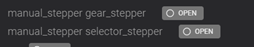
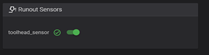
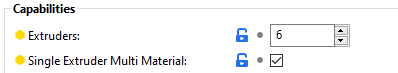
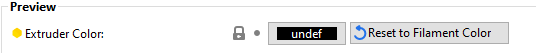
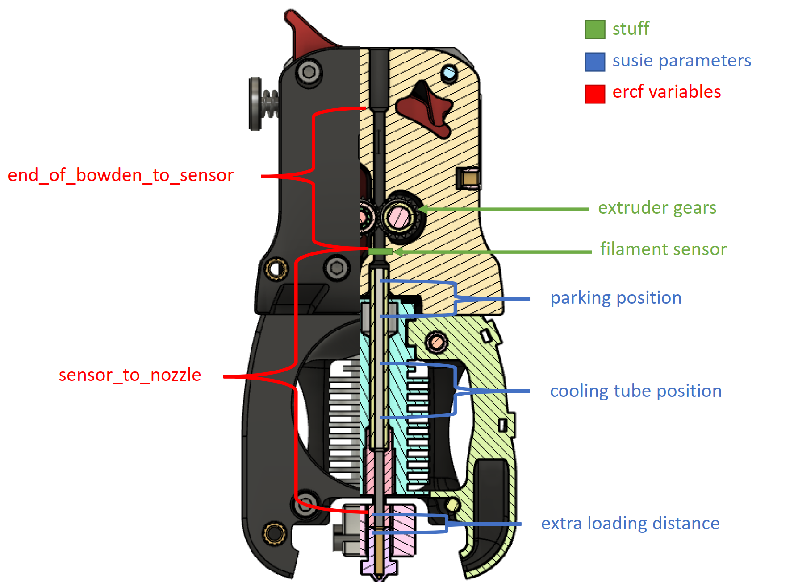

# The print

If you have printed a voron this is the familiar part. Use standard Voron print settings (listed below.) All files are available online[ ERCF](https://github.com/EtteGit/EnragedRabbitProject). The BOM can be found[ here](https://docs.google.com/spreadsheets/d/1djVxoKnByb41ifVy2JTfhXmdf9UYpnUYfhvcNyUDuLw/edit#gid=0).  

In the US formosissima has kits available. I am building using these kits.
[Feeder](https://formosissima.com/products/mother-fucking-rabbit-kits),[ Patch](https://formosissima.com/products/enraged-rabbit-carrot-patch), and[ PTFE](https://formosissima.com/products/transparent-fep-tube-for-bowden)

 
**Recommended Print settings**

### LAYER HEIGHT
   - Recommended: 0.2mm
### EXTRUSION WIDTH
   - Recommended: Forced 0.4mm
### INFILL PERCENTAGE
   - Recommended: 40%
### INFILL TYPE
   - Grid, Gyroid, Honeycomb, Triangle or Cubic
### WALL COUNT
   - Recommended: 4
### SOLID TOP/BOTTOM LAYERS
   - Recommended: 5 

**STL naming convention**s
* Primary Color 
These files will have nothing at the start of the filename.
*  Accent Color
 Will have an “[a]” to the front of any STL file that is intended to be printed with accent color.
 
**Quantity  Required**
 Any file ends with “_x#”, that is telling you the quantity of that part required to complete the build.

**Variable Quantity Required**
 Any file ends with “_xN”, that is telling you the quantity of that part required to complete the build. N In this case will be equal to the channels that you are building in the ERCF.

# Building

After the prints you need to build the 3 current components of the ERCF system.

**The Carrot Feeder**: 

This is the main unit. The Carrot Feeder allows the use of a high number of different filaments (tested up to 9 channels so far) and feed them, one at a time, into the printer tool head. The Carrot Feeder gear motion system (i.e. what is used to push and pull the filament) uses part of the Voron Design M4 extruder (namely the whole 80T wheel and part of the motor support//tensioning system) Build guide located[ here](https://github.com/EtteGit/EnragedRabbitProject/blob/main/Carrot_Feeder/CarrotFeederAssemblyAndSetup.pdf).

 **The Carrot Patch**:

a spool-holder and buffer combo to help you deal with the filament management issue associated with multi-material systems.
Build guide located[ here](https://github.com/EtteGit/EnragedRabbitProject/blob/main/Carrot_Patch/CarrotPatchAssembly.pdf).

**The filament sensor**:
Special note these are all essentially user mods. With that being the case the BOM for the rabbit does not cover the parts for these mods. Please refer to each one for the required components.

A filament sensor system located below the gears of the tool head, to check proper loading//unloading of filament. There are versions available for :

 Regular AfterBurner [ (AB) Toolhead](https://github.com/EtteGit/EnragedRabbitProject/tree/main/usermods/AB_Toolhead_Sensor)
 
     
 Galileo Clockwork:
 
 [ Optical Version](https://github.com/EtteGit/EnragedRabbitProject/tree/main/Filament_Detector) – Sensor I used from amazon[ here](https://www.amazon.com/gp/product/B07PYQWGK1/ref=ppx_yo_dt_b_asin_title_o00_s00?ie=UTF8&psc=1)
 
 [ Microswitch Version](https://discord.com/channels/460117602945990666/708863940171661364/839634846510612530)
     
LGX on AfterBurner (AB) tool head you’ll find those either on the main project folder or in the usermods folders. -[ here](https://github.com/EtteGit/EnragedRabbitProject/tree/main/usermods/LGX_Toolhead_Sensor)

New tools and mods can be viewed under[ usermods](https://github.com/EtteGit/EnragedRabbitProject/tree/main/usermods/LGX_Toolhead_Sensor).

 

# Klipper Configuration

1. Add a call to printer.cfg for the macros and hardware configuration. [ Example here](https://github.com/EtteGit/EnragedRabbitProject/blob/main/Klipper_Macros/printer.cfg). This is added to the existing printer.cfg. It does not replace it.

2. Download ercf_hardware.cfg and ercf_macros.cfg upload to your configuration folder (see fluid example below). They can be downloaded from[ here](https://github.com/EtteGit/EnragedRabbitProject/tree/main/Klipper_Macros).

	

3. Under the extruder Add or modify the max_extrude_only_distance: 200

	
4. Open ercf_macros.cfg search for HOME_ERCF. And replace them with ERCF_HOME. To be fixed soon.

# First movement and checks.  

1. Check end stops are working and triggering correctly. Manual_stepper selector_stepper is the endstop that is bumped by the cart. Ensure that it is open and not triggered.

	

2. Check end stops are working and triggering correctly. Manual_stepper gear_stepper is the optical endstop in the cart. It should have a red glow when not triggered and off when triggered. You can use a piece of filament pushed in to trigger it. If you see the light but it does not go off. Please refer to the[ carrot feeder assembly guide section 13-b](https://github.com/EtteGit/EnragedRabbitProject/blob/main/Carrot_Feeder/CarrotFeederAssemblyAndSetup.pdf) for calibration of the optical sensor spacing. 

3. Ensure the Runout sensor in the toolhead is working.

	Without filament loaded in Fluidd

	

	With filament loaded in Fluidd

	

4. Servo test to ensure the servo moves and is in the proper location. Refer to carrot feeder assembly section 13-a[ here](https://github.com/EtteGit/EnragedRabbitProject/blob/main/Carrot_Feeder/CarrotFeederAssemblyAndSetup.pdf) for location.  

- Use SERVO_UP
- Use SERVO_DOWN

5. If the servo arm does not move to the correct angle. You can use SERVO_TEST VALUE=XXX. Once you have the correct angle for your servo. Modify the angles for each in your ercf_macros.cfg and save and restart.

6. Use STEPPER_BUZZ STEPPER="manual_stepper gear_stepper" to test that the gears turn.

7. Use STEPPER_BUZZ STEPPER=" manual_stepper selector_stepper" to test that the selector motor moves.

8. Use ERCF_HOME check that the carriage moves in the direction of the endstop and the gear moves in the load direction. (be ready to stop it if the carriage moves the wrong direction) Add or remove the (!) on the direction pin as needed to change the direction.

## Tool head variables

### variable_sensor_to_nozzle:XX

Length from the sensor to the nozzle melting pool 

1. Feed filament into the toolhead until the tool head sensor triggers.

	

2. Ensure your nozzle is heated. 

3. Extrude in 5 mm sections till you see just a hint of filament (does not need to push the old out) come from the nozzle. Take the distance you moved and use this value. 

### variable_end_of_bowden_to_sensor: XX 

Distance between the end of the reverse bowden and the toolhead sensor. Value is toolhead specific
	
1. Feed filament into the toolhead until the tool head sensor triggers. 

	

2. Retract filament in 5mm sections till extruder releases the filament.

3. Mark the filament at the exit point with a marker. 

4. Pull the remaining filament from the tool head and measure the remaining filament from the mark to the tip. 

5. Add the retracted filament and the remaining distance. You can easily subtract 5 mm from the final number and this should be the value to be used. 

         

# Calibration/Setup

## Loading patches/Determine buffer need.

In general you need enough buffer to support filament rewind from the tool head back to the carrot feeder. Plus an additional 10 cm. This will be determined by the length of the Bowden from the carrot feeder to the head and the placement of the feeder. In testing you need a loop on the wheel for every 30cm of filament.

**(Bowden length in cm + 10cm)/30= (Loops needed rounded up to next full number)**

 
## Rotation distance

 Just like a standard extruder you need to tune the step distance.

1.Feed some filament into the first channel without PTFE tube on it. At least 120 mm worth

2. ercf_home

3. select_tool Value=0

4. Measure from the ecas out 120 mm on the filament and mark the filament with a marker

5. Use “MANUAL_STEPPER STEPPER=gear_stepper SET_POSTION=0” To 0 the current location.

6. Use “MANUAL_STEPPER STEPPER=gear_stepper MOVE=100”

7. Measure the distance from the ecas to the mark.

8. (Current step_distance x 100)/(120 - remaining measurement)= New Step_distance

9. Modify gear stepper step distance in ercf_hardware.cfg and save and restart.

## Bowden calibration

1. Home the printer

2. Home the rabbit. (ercf_home)

3. Use ercf_calibrate_all to do a full calibration or ERCF_CALIBRATE_SINGLE channel=0 to calibrate a single channel starting with 0 up to the # of channels you have.

4. Wait for calibration to complete.

- It should move to the first channel or specified channel if doing a single.
- Will load the filament to the ERCF.
- Then will move out to the specified Bowden length in ercf_macros.cfg variable_min_bowden_length: XXX
- It will then engage the extruder and start moving slowly forward until the extruder engages.
- You should see an output in the console.

	

- It will back out of the extruder and rewind.
- If you are doing all it will then move to the next channel.

5. You will see in the console a value for each channel.

 

6.Open ercf_macros.cfg and modify the line below with each value. Then save and restart

 

7. Final check: use “Change_tool_standalone tool=0”, then do “Change_tool_standalone tool=1” ensure that the filament loads correctly then unloads and loads the second channel.

**Notes: If you see a pause that means something did not complete correctly**

### Super Slicer/Prusa Configuration

While not necessary it is highly recommended that you are starting with a good working profile for your printer to begin with.

1. Open the printer profile that you want to use multi-material printing with in super slicer/prusa slicer. Select the Printer settings tab. And highlight general in the left side column. You need to have settings set to expert in the top right corner. Set the # of extruders to the the # of channels that you have built into your ERCF.  And check the box for a single extruder. 

2. Next select Single extruder MM setup 

)

- Cooling tube position is the distance from the nozzle to middle of the PTFE tube from the extruder to the hotend.(see Useful diagram section for diagram of common measurements)
- Starting values below can be used. But may need to be adjusted for your system. 

	

- Cooling tube is the length of the PTFE from the extruder to the hotend.
- Filament parking position, This is from the nozzle to the point of disengagement of the extruder teeth. Because the common height of the AB platform most extruders can start around 85mm 
- Extra loading distance. This should be a negative number less than filament parking position. This is used to reload the filament without causing blobbing.

3. You should now have an extruder on the left for each channel of the ERCF now. You can set any specific extruder setting needed on a per filament basis if needed. However it may be useful to select unique filament colors even if the colors you will be using may be different. This can be quickly changed when loading a multiple material print later. 

	

4. Select Print settings. Select multiple extruders section. Check Enable under Wipe Tower. Uncheck Prime all printing extruders. You can set specific extruders for specific use cases on this tab. These are more your preference but would suggest taking a moment to familiarize yourself now. 

5. Optional depending on need you may need to create a filament profile per use case. To set things like temp and flow on a per filament basis. 

## FAQ/common issues 

- On a failure during a print if you clear the error/jam/issue. You can look at the console for "change tool tX" to determine what filament should be loaded before resuming the print.
- Filament sensor arm in the cart will wear down with the current iteration. If you have issues with it starting to not retract enough filament or homing starts to fail consistently. Check if it can be tuned on the 2 bottom screws if not replace it. 
- In some versions of the ERCF_MACRO.cfg there are references to HOME_ERCF. This is an incorrectly formatted reference.  Use  find and replace of any references and change to ERCF_HOME. 

# Useful diagrams and measurements

**After burner with a V6**

 
    

**Galileo with Mosquito**
 
	
**Common toolhead starting distances**
 

# Useful Command and Macro

## Testing commands 

“SERVO_UP” Moves servo to the “variable_servo_up_angle: 145” value set in the ercf_macros.cfg file. 

“SERVO_DOWN” Moves servo to the “variable_servo_down_angle: 82” value set in the ercf_macros.cfg file. 

“ SERVO_TEST VALUE=145” Used to test the angle of the servo to fine tune the pressure on the filament blocks.  

“STEPPER_BUZZ STEPPER="manual_stepper gear_stepper"” Used to test the stepper movement prior to use. 

“STEPPER_BUZZ STEPPER=" manual_stepper selector_stepper"” Used to test the stepper movement prior to use. 

“MANUAL_STEPPER STEPPER=gear_stepper SET_POSTION=0” Used to set the location of the filament feed prior to e-step testing. 

“MANUAL_STEPPER STEPPER=gear_stepper MOVE=100” Used to feed a specific amount of filament for testing. 

## Calibration commands 

“ERCF_CALIBRATE_ALL” Starts a calibration of all channels. Must home ERCF prior to use.

“ERCF_CALIBRATE_SINGLE channel=0” Starts a calibration of a single channel. Must home ERCF prior to use. 

 

## General use commands

“ERCF_HOME” Attempts to unload any filament in ERCF or the tool head. And homes the selector location. Then loads and unloads channel 0. Useful for unloading and preparing the ERCF for use. 

“ERCF_UNLOCK” in the case of a failure in most cases it will move the tool head to a parking position and pause any print or actions. This is used to reset the ERCF to prepare for a homing or will move the servo to an unlocked position to unload any stuck filament. 

“select_tool Value=0” Sets the tool that is currently in use. Change “0” to the channel you wish to select.  

“Change_tool_standalone tool=0” Used to load filament for a specific channel. Useful for printing using the slicer without running it in multifilament mode. Change “0” to the channel you wish to select. Will unload any currently loaded filament. 

 

 

 

 
