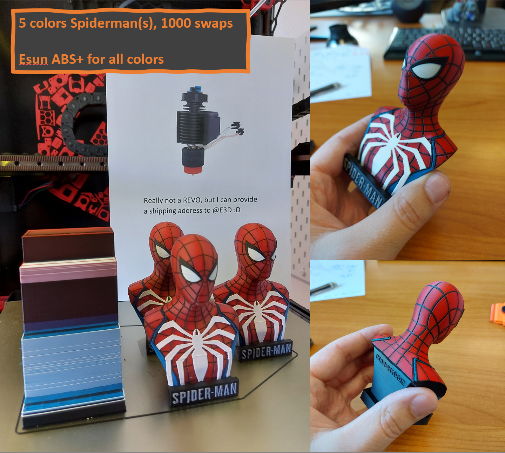
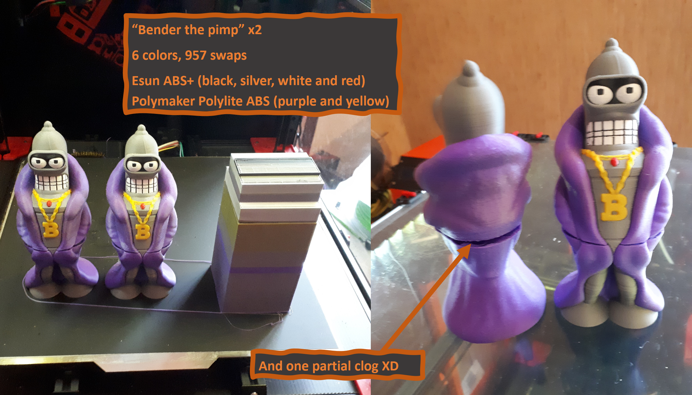

# EnragedRabbitProject

Welcome to the Enraged Rabbit Project Github page!

This project aims to bring multimaterial capabilities to 3D printers using a single Direct Drive toolhead. While this project is mainly dedicated to be used on VORON printers, it can also be used (or adapted) on any 3D printer that runs Klipper, and potentially RRF.

You like this project? You want to support me and my work, help me bring new cool stuff to the community? Well you can tip me here :

## Table of Content
- [Changelog](#changelog)
- [Showroom](#showroom)
- [Videos](#videos)
- [Details](#details)
- [BOM](#bom)
- [Acknowledgements](#acknowledgements)
- [FAQ](https://github.com/EtteGit/EnragedRabbitProject/tree/main/Documentation/FAQ)
  - [Carrot Patch](https://github.com/EtteGit/EnragedRabbitProject/blob/main/Documentation/FAQ/FAQ_ERCP.md)
  - [Carrot Feeder](https://github.com/EtteGit/EnragedRabbitProject/blob/main/Documentation/FAQ/FAQ_ERCF.md)
 
## Changelog
- **October 23th 2021 :** Update of the ERCF Macros and python module and added first part of manual Slicer setting section.
- **October 15th 2021 :** Added AfterBurner Clockwork toolhead sensor and associated manual sections.
- **October 7th 2021 :** Updated SwitchWire mount, LGX on AfterBurner toolhead sensor and associated manual sections.
- **October 1st 2021 :** Update including VORON SwitchWire mount, new Galileo Clockwork Toolhead sensor, additions to the manual and a few others things!
- **September 24th 2021 :** The ERCF V1.1 macros and python module are out! Also an updated manual (with the setup and calibration steps) and additionnal stuff for EASY BRD users! Have fun!
- **September 17th 2021 :** The ERCF V1.1 assembly manual, STL files and the STEP file are now released! You'll find the manual in the "Documentation" section now, and the manual will keep growing with setup, tuning and slicer guides. A non-exhaustive patch note can be found in the Carrot_Feeder folder. Finally, note that the new software part of the ERCF V1.1 is not out yet, and the ERCF V1.1 hardware cannot be used with the ERCF V1.0 macros. V1.1 software will be released in a few days. Happy printing and assembly!
- **September 14th 2021 :** Updated the BOM to ERCF V1.1 (release coming soon! tm) and added the new, incoming Toolhead Sensor BOM (bottom tabs)
- **June 4th 2021 :** TopHatLockers and related (servo arm, TopGearHat, macros) have been released to the main branch, from the EarlyDevAccess branch. If you're already running EarlyDevAccess stuff, that won't change anything for you
- **June 2nd 2021 :** Release of Carrot Patch V1.1
   - Increased handles section near the threaded insert for more robustness
   - Removed useless chamfer on feet bottom screw holes and increased hole depth (one can now properly use M3X8 SHCS to secure the Carrot Patch on 2020 extrusions)
   - Fixed several parts lengths//size that impacted the buffer wheel installation. Now the wheel should slightly touch both side walls (to avoid any possible gaps) while being able to turn (but not freely, which is on purpose)
   - Buffer Cross bottom arm is now secured using a M3X20 SHCS screw that comes from the bottom (that is also securing the left feet of the Carrot Patch)
   - Buffer Cross ECAS insert has been tuned, reinforced and a "bridge" shape has been added. Inserting the ECAS will no longer crack the plastic
   - Increased the size of the Buffer Cross "pillar" that sits between the two PTFE paths (some users previously reported fragilities due to the lack of matter for this pillar)
   - Updated the assembly manual, BOM and the CAD accordingly
   - Only parts that did not change are : [a]_Buffer_Wheel, [a]_Latch, [a]_Sliding_Arm, Buffer_Axis, Ptfe_Entry_ECAS and Ptfe_Entry_M10

## Showroom

## Videos
Here are videos of the system in action. I need to release more videos...

https://streamable.com/3lo192

https://streamable.com/cjl2iz

## Details

There are 4 components so far : 
 - **The Enraged Rabbit Carrot Feeder (ERCF)**. The Carrot Feeder allows to use a high number of different filaments (tested up to 9 channels so far) and feed them, one at a time, into the printer toolhead. The ERCF gear motion system (i.e. what is used to push and pull the filament) is based on the Voron Design M4 extruder. The ERCF was inspired by the Prusa MMU2 and the Smuff.

  
 
 - **The Enraged Rabbit Carrot Patch (ERCP)**. It is a light spool-holder and buffer combo to help you deal with the filament  
management issue associated with multimaterial systems.
 
 
 - **The Enraged Rabbit King's Seat (ERKS)**. The King’s Seat is a pellet-purge system to remove the need for a wipe-tower and make faster filament purges. This system is designed for Voron V2s only so far.
 - **The filament sensor** : a filament sensor system located below the extruder gears to check proper loading and unloading of filament.
  
Note that this is a work in progress !!
 
Only the King's Seat is yet to be released !
 
## BOM
 The BOM for those components can be found [here](https://docs.google.com/spreadsheets/d/1A_qeNeaVprh_iPbvLcLjvJ2o2NfCzjuJam3K3RkWW0w).
 
## Acknowledgements

Thanks to the VORON Design devs and VORON discord members for the discussions and support, with a special thanks to the #honhonhonbaguette-FR members and @Tircown#8715!!

Ette
