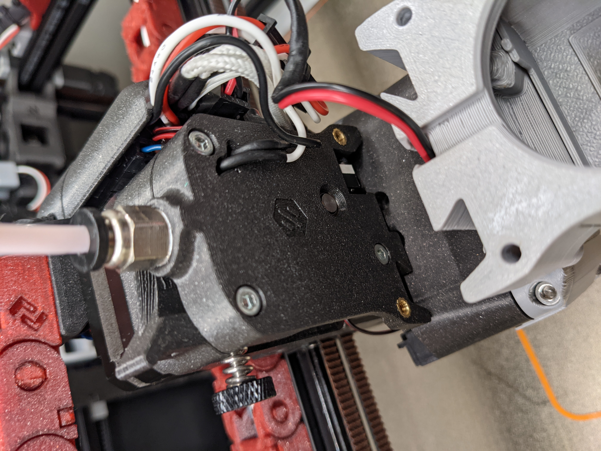

# The "Poor man's SmartWatch" - OLD REVISION

**A NEW VERSION IS AVAILABLE, IT'S RECOMMENDED TO PRINT THAT**

This is my take on making the standard AB clockwork "smart" by inserting filament sensors in the toolhead.
The goal was to keep the BOM to a very bare minimum, using just a common microswitch and a 7mm steel ball, so that every penny saved here can be spent in moar modifications to our dear machines.

I started to develop a sensor housing when I first started my multimaterial journey, and at the time I was convinced that having a sensor above the BMG gears would be great for timing the retract/unretract from parking position to toolhead.
Then, after talking to some fellow Voroners (looking at you Ette), I realized that a much more useful addition could be a sensor also *below* the BMG gears, so I tried to add a second one in that position.
This is the reason why here you'll find 3 different toolhead configurations (both sensors, onlyt the one above and only the one below gears).
I'll show BOM and instructions just for the config with 2 sensors, should be easy enough to adapt to the other two.

## Very Important Info
- This is an hack'n'saw CAD job, miles away from a proper design feat, thus you may or may not find the thing useful or even working at all. I did just a very limited testing on it.
- In order to fit the 7mm ball in the sensor above gears, I needed to file down a couple of mm from extruder stepper shaft (stock OMC pancake). Not a big deal for me, but be warned.
  
## Sligthly less important info
- This is meant to be used for multimaterial timing/checking purposes, it is NOT a "standard" runout filament sensor. If you plan on using it that way, Klipper buffer will bite you.
- I tried my best to keep the bridging to a minimum, but having a well calibrated printer will help a lot in obtaining a smooth slot for the 7mm ball to slide in (and ofc a smooth filament path).
- STLs are not (yet) oriented in correct way for printing. They're meant to be printed in the same orientation of the stock ones from which they're derived (i.e.: orient the modified clockwork body as the original clockwork body). This will be fixed soon.

## BOM (for 2 sensors config)

- **n°2 microswitches** - a spare Omron from printer BOM is best, but also cheapo no name ones should work fine.
- **n°2 7mm steel ball** - any source is fine. I used a couple from a multisize package for decorative work from Amazon.
- **n°4 M2x10ish self tapping screws** - any source
- **n°1 M2x12 self tapping screw (optional)** 
- **wires and connectors of choice**.

## Streamlined instructions

1. Print all of the required pieces. Standard Voron settings are recommended.
2. For each sensor insert the ball in the slot, and CHECK FOR IT TO MOVE SMOOTHLY. This is very important step, ball should be falling out easily when you move the clockwork body. If that's not the case, you can try to smooth down internal imperfections with an angeld tool (allen key or similar), or reprint the piece.
3. Once the ball is in place, slide the switch in place, routing the cables as you do so. For sensor above gears, you need to insert wires in the opening on the plate *before* putting the connector on (I know it's a major annoyance, but I couldn't find a better way).
Gently bend the switch pins if needed.
Note that the switch should be oriented as shown in the images. The lever end far from the small button is the one that touches the ball.
4. Secure switches with the M2s.
5. Try to insert a piece of filament into the filament path and check the right activation/deactivation of each switch, hunting for the clicking sound. If contact is not 100% reliable, you can gently bend the lever inward or outward until it slightly pushes against the ball (without filament inserted).
The idea is to use the lever to keep ball from rattling around, but also allowing for some "springiness" after switch activation.
6. Once you're satisfied, slide in the "InnerCover" piece (optionally securing it with a M2 screw), assemble the rest of the toolhead, connect wires to MCUs, tweak the config to your liking and you're good to go!

