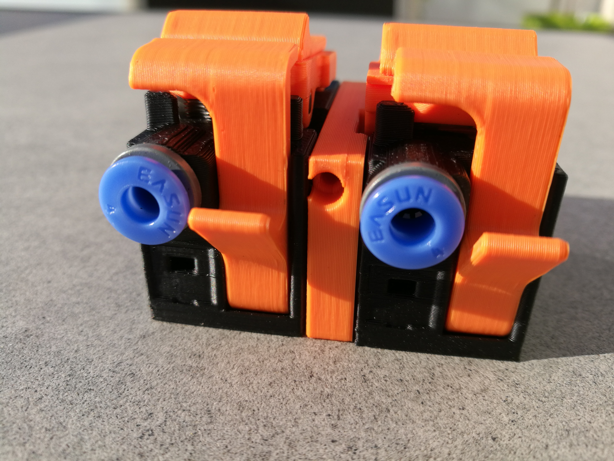

## Bearing block with a passthrough

Allows to do tests or add a temporary spool without taking apart the full setup while still benefit from the sensors of ERCF.

No need to use two of these for a 9+ blocks ERCF.

Supports are build-in.

**This piece is 1mm wider than the 5mm of the original one, be sure to update your macros and positioning of the carriage**
**The bearing is mounted on the other side compared to the original one**

