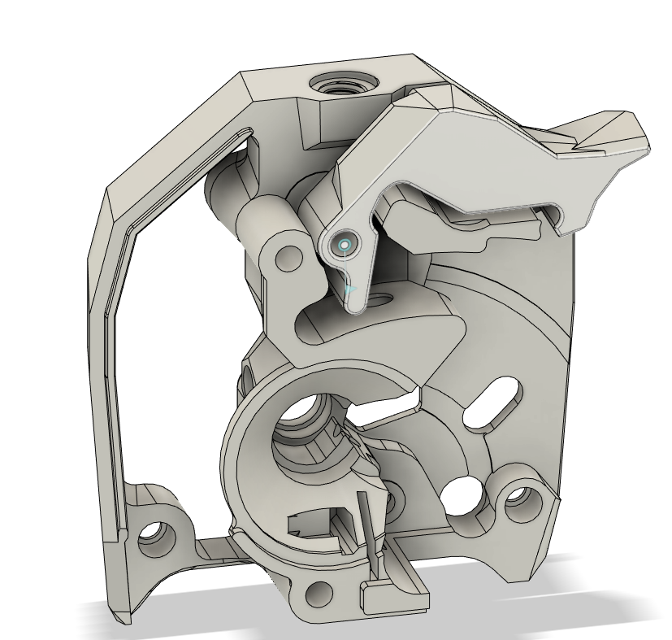
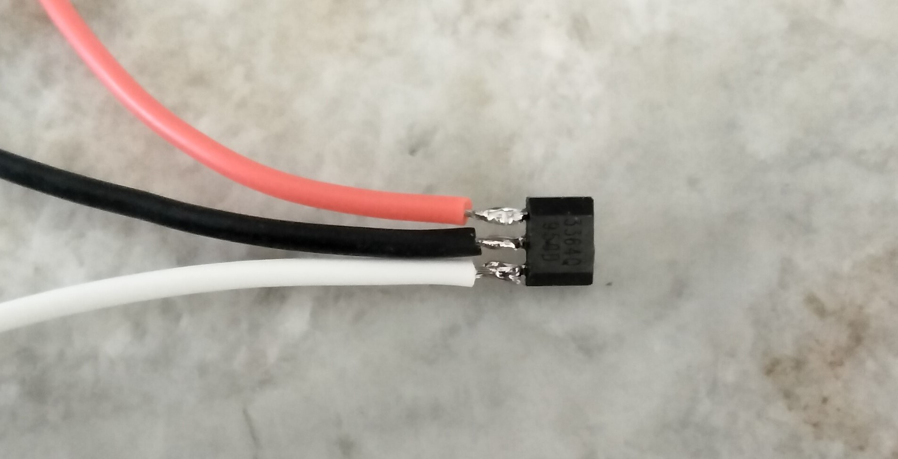
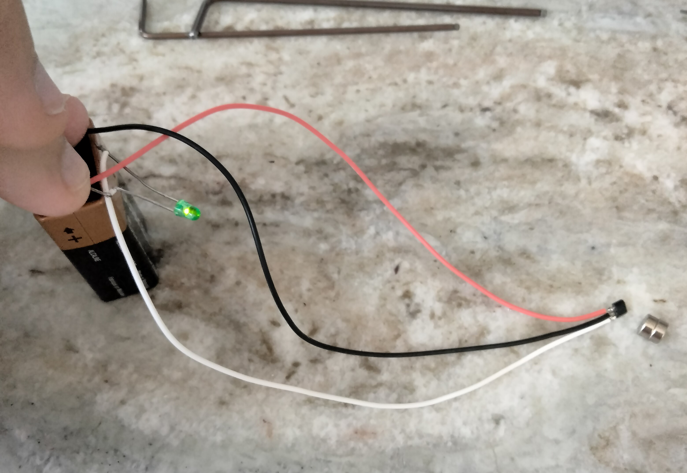
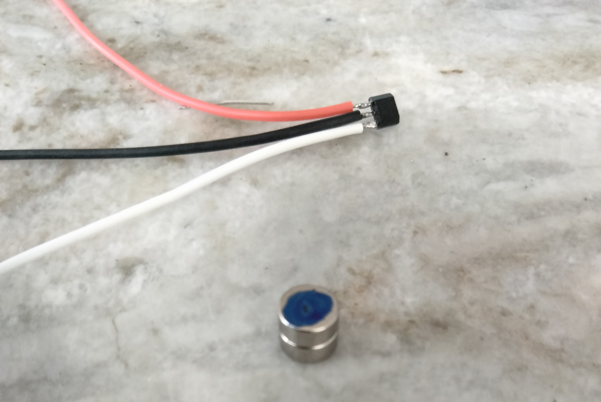
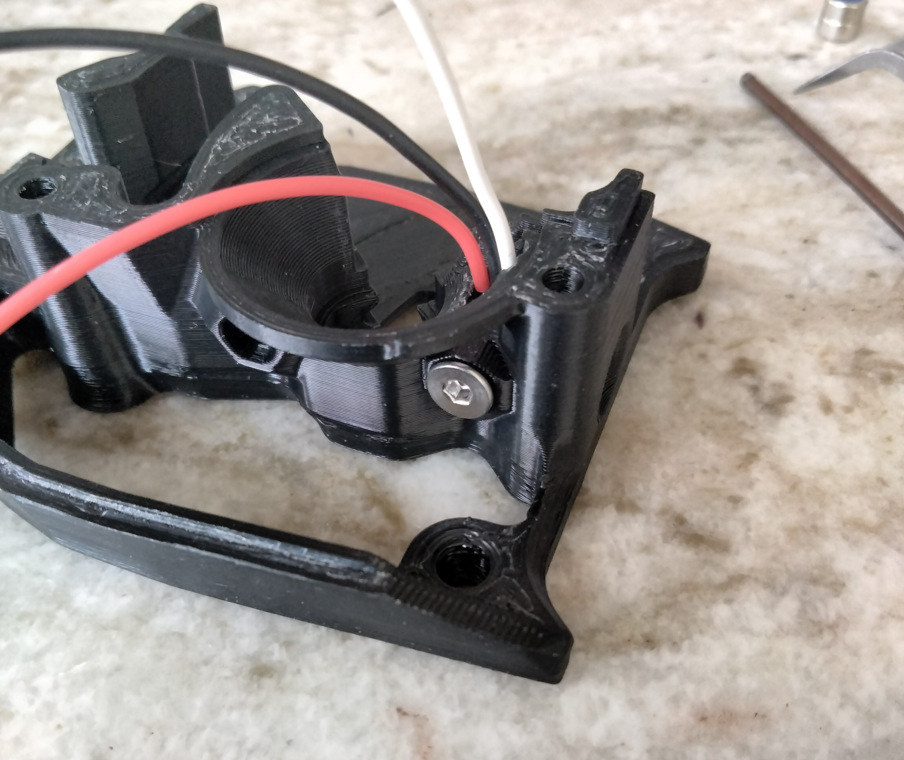
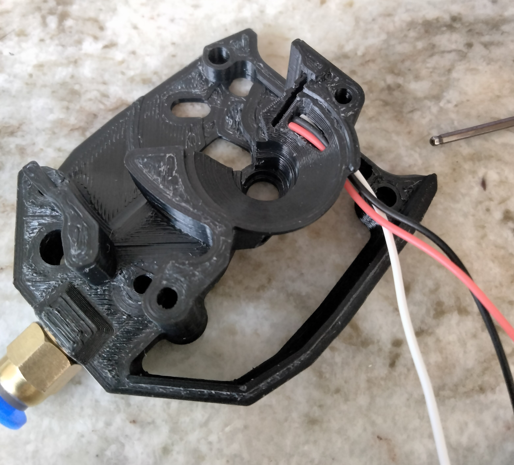

# Enraged Rabbit-style hall effect filament sensor for Clockwork 2 (StealthBurner)

I wanted to run a StealthBurner with a SB breakout board and with filament sensor. Unfortunately, these requirements do not stack up. If using Clockwork 1 with a StealthBurner, one could only use an afterburner breakout board, not a SB board. I looked all over the internet and didn't find any Clockwork 2 mod that includes a filament sensor.
Also I found out that StealthBurner has been finally released 5 days ago (at the time of making this mod), so here we go: my honest attempt to modify Clockwork 2 so that it includes a filament sensor, while trying to preserve stealth-geometry-style of the thing.

## Parts required for this mod:

* (1) AH3364Q-P-B hall effect sensor
* (3) piece of thin stranded wire (preferably different colors)
* (1) 6x3 neodymium magnet
* (1) M3x8 FHSC - stainless steel or brass
* (1) pneumatic fitting

## Printing:

Print parts using standard Voron spec:
* main_body.stl - using the main color
* [a]_latch.stl - using the accent color

##  Assembly
### Preparation

For this mod you need to cut the sensor leads short. Just enough to solder wires to. This is because there is not much room in the Clockwork 2 to route the wires and you need wires to be fvery flexible right after the sensor.
Holding the sensor in some kind of metal clamping device (wise, alligator clip, etc.) helps a lot as it aids with heat dissipation and prevents overheating.
This way you don't need any heatshrink as all the movement is constrained by tiny leads. You can dab a drop of hot glue after soldering the wires if you want.

In this case I soldered red wire for positive, black for negative and white for signal.

Next thing to do is to determine which side the magnet needs to go in.
I prefer to use a LED with a resistor and a 9V battery to test the correct polarity of the magnet. To do this connect LED anode to a positive wire and the cathode to the signal wire. Then touch positive and negative wires to the corresponding battery leads.

Now slide the magnet towards the chamfered end of the sensor. One side of the magnet will trigger it, another will not. Mark the side of the magnet that does.

### Installation

I prefer to start with the pneumatic fitting. Due to space constraints it has to be mounted in a way so it doesn't interfere with the latch. The latch in this mod already has a notch to clear the protrusion formed by the fitting mount. I didn't want to cut it too much as it weakens the part. So please orient the fitting with a flat side towards the latch:

After the fitting is installed it's finally time to install the sensor. Thread the screw into the hole. Don't tighten it fully yet. Push the sensor into the recess just like the original afterburner sensor. This time, however, you will not have sensor leads to guide it inside, so take some tweezers to push it in. Paperclip works well too. Hold it bottomed out and tighten the screw so it holds the sensor. Do not overtighten.

A few very important notes:
1. Don't use regular screws - they are magnetic and will interfere with the sensor operation. Use non-magnetic stainless steel or brass screws.
2. There is a 0.4 mm wall between the screw and the sensor to prevent sensor damage from the screw. Do not overtighten.
3. Nylon screw might work too (I haven't tried). In order for nylon screw to work you will need to fix it with a regular screw first - this will establish the threads and break the wall a little bit. Then substitute it for a nylon screw.

Finally route the wires through the hole.

Insert the magnet with the marked side first. This will leave non-marked shiny side sticking out.

Assemble the rest of the extruder as usual.

Enjoy!
