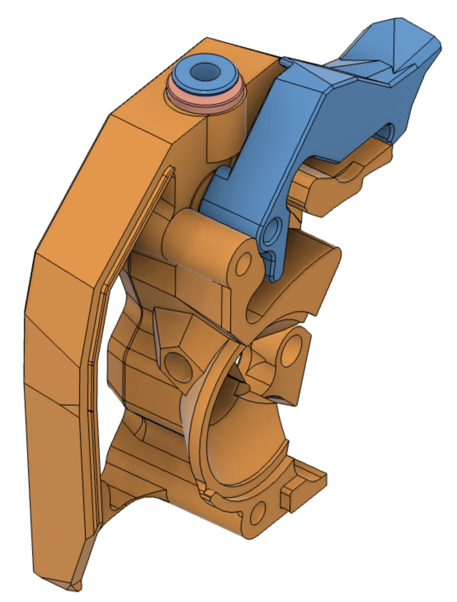
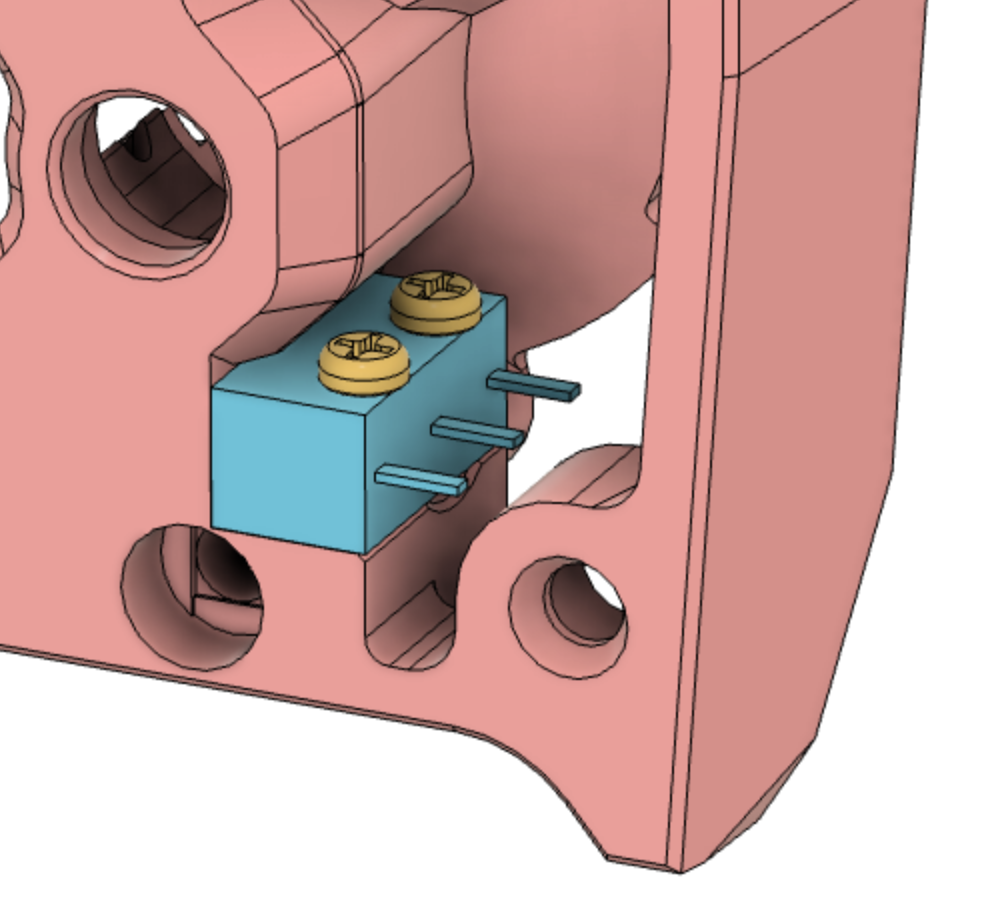
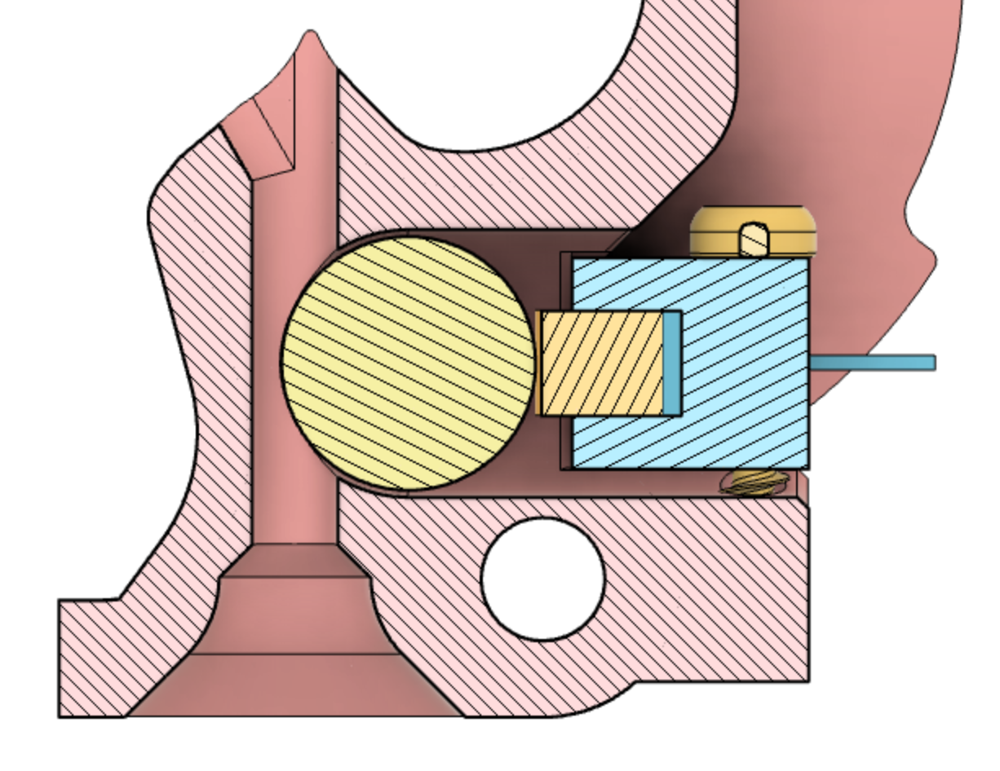

## Clockwork 2 with ECAS fitting, with or without ball bearing filament sensor

This version of the Clockwork 2 extruder adds an ECAS fitting to the filament
input port. The ECAS serves the same purpose as a screw-in PC4 fitting: to retain
the PTFE tube during ERCF operations so it doesn't pop out. 

Optionally, you can print a version that includes provisions for a mechanical filament
sensor that uses a ball bearing and microswitch. See below.

The basis for these designs is the VoronDesign/Voron-Stealthburner project on GitHub as
of August 18, 2022, git commit b2cf2c2. Here are a
[link to that commit](https://github.com/VoronDesign/Voron-Stealthburner/tree/b2cf2c2c0436d734181688ae3019b9dffb835b8b) 
and a [link to the current version](https://github.com/VoronDesign/Voron-Stealthburner) 
of the Voron-Stealthburner project.

The version of Voron-Stealthburner on which this mod is based postdates RC1. 
Both the CW2 main body and the 
latch have been updated relative to the RC1 release of Voron-Stealthburner.
However, RC1 versions of other parts **are** compatible with this main body and latch.

The parts in this mod **are not** compatible with pre-RC1 versions of the Clockwork 2.
Please see the pinned mod in the Discord #ercf_questions channel if that's the CW2
you want to modify.

## ECAS-only (no filament sensor)

For the ECAS-only version, you just need to print the main body
and the latch. The rest of the parts are identical to the standard CW2.

Press-fit the ECAS into its dedicated hole as described in the ERCF documentation. Done!

## ECAS and filament sensor

The filament sensor included here uses a 7mm ball bearing and a standard microswitch. It
is *not* a direct port of the standard ERCF toolhead switch, which uses a Hall-effect sensor.
The mechanical version seems to be somewhat less susceptible to jamming and misreading.
However, it does introduce a small amount of friction on the filament path. 

### Bill of materials

You will need:

- An Omron D2F-series microswitch with lever, or equivalent (e.g., D2F-01L, see below)
- Two M2x10 self-tapping screws
- One 7mm ball bearing (stainless steel is fine, does not need to be magnetic)
- One ECAS fitting

According to Omron's CAD files, the plunger on
a D2F without a lever is shaped slightly differently from the plunger on a lever
switch. This mod is designed for a lever switch even though the lever isn't used. 
Plunger-only
switches might work fine. I just don't know for sure.

The mod also assumes that the switch's operating force is the standard 1.47 Newtons.

See Omron's [D2F data sheet](https://components.omron.com/us-en/datasheet_pdf/B036-E1.pdf)
for details on decoding all the variants of this switch. The model number should end with an
L and should not contain an F. Any voltage or current rating is fine. You probably want
standard PCB terminals, but any variant should work. However, be sure not to block the
cutout next to the switch, as that's a through-way used when bolting the CW2 to the
carriage.

### Operating principle

Here's a cutaway view of the sensor when assembled:

The ball bearing intrudes into the filament channel. When filament is present, it
pushes the bearing aside, causing it to activate the switch. 

### Assembly instructions

- Remove the lever from the switch. 

- Print the test block.

- Insert the ball bearing into the test block. It should pop in with just slight pressure.

- Screw the microswitch into the test block. Make sure the plunger of the microswitch is 
centered on the bearing. For Omron switches, the side with printing on it should be down.

- Make sure that filament can easily be inserted (even with a blunt end) and that 
the sensor assembly does not
add excessive friction.

- Use a multimeter to verify that the switch consistently activates when filament is 
present and deactivates when filament is removed.

- If you have problems with friction or failure to register filament, see the section
below regarding alternate STLs.

- Print the main body and the latch.

- Press-fit the ECAS into the top of the main body.

- Solder two wires to the switch and cover them with heat-shrink tubing.
Use the two outer leads for normally-closed mode, which is recommended.
Ignore or cut off the middle lead.

- Install the ball bearing and switch in the main body of the CW2.

- Install the new main body and latch on your CW2.

- This mod shortens the bottom end of the filament path by 3mm. So 
shorten the stub of PTFE tubing coming out the top of your hotend cartridge by 3mm.

- Once the new parts are installed on the CW2, you can bend the PCB leads coming 
out of the switch to direct the wires more naturally. Not much bend is needed if
you are using a standard cover and PCB.
Do not bend the switch leads downwards so
that they interfere with the wrench path for attaching the CW2 to the carriage.

- Add the appropriate connector to the other end of the wires, hook up, and configure
in the ERCF control files for Klipper.

### Alternates

If the test block seems to indicate that filament won't be reliably detected, or 
will be unreasonably pinched by the ball bearing, you can try the "tight" or "loose" 
variants from the Alternates folder.

- The tight version moves the ball bearing channel and the switch further
*into* the filament path. This *increases* friction, makes it *harder* to get 
filament past the ball bearing, and makes it *easier* for filament
to activate the switch.

- The loose version moves the ball bearing channel and the switch further
*out of* the filament path. This *reduces* friction, makes it *easier* to insert filament, 
and makes it *harder* for filament to reliably activate the switch.

I don't yet have data on other people's experience with this filament sensor design.
My hope is that the standard configuration will cover nearly all cases, but 
filaments and tuning
vary. The loose and tight versions are just there to give you a backup plan. Stick 
with the standard version unless you're encountering specific issues.

## Bug reports and suggestions

For problems or suggestions, you can file a GitHub issue against 
[my fork of the ERCF project](https://github.com/GarthSnyder/EnragedRabbitProject).

I am @Iatrodectus on Discord and @GarthSnyder on GitHub.

