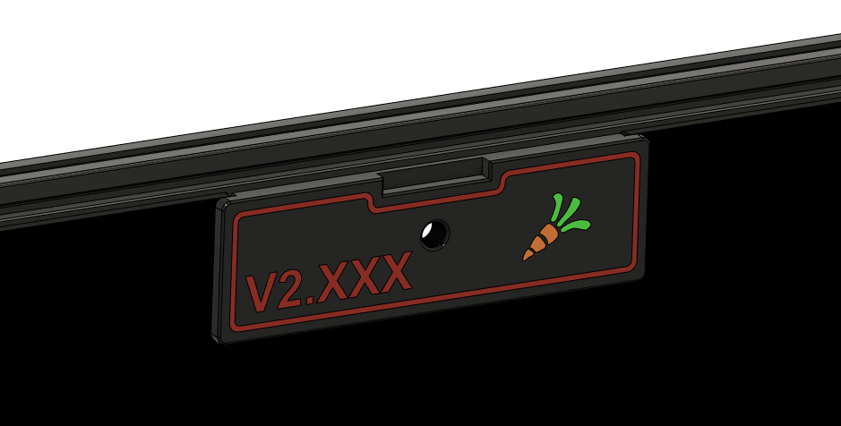

# Closed, multimaterial exhaust plate for V2.4

This mod, inspired from the closed exhaust plate from @Elpopo (see here : https://github.com/elpopo-eng/VoronFrenchUsers/tree/main/Mod/RearShutter), replaces the nominal V2 exhaust parts with a close, sealed plate. Reverse bowden connector thread is a M10.

It's designed as a multicolor print.

You can edit your V2 serial number in the f3d file (or on the .step if you don't have Fusion360). Use adhesive foam on the inner groove to ensure proper V2 chamber sealing, and use the regular inner front plate of the V2 to fix this mod.

