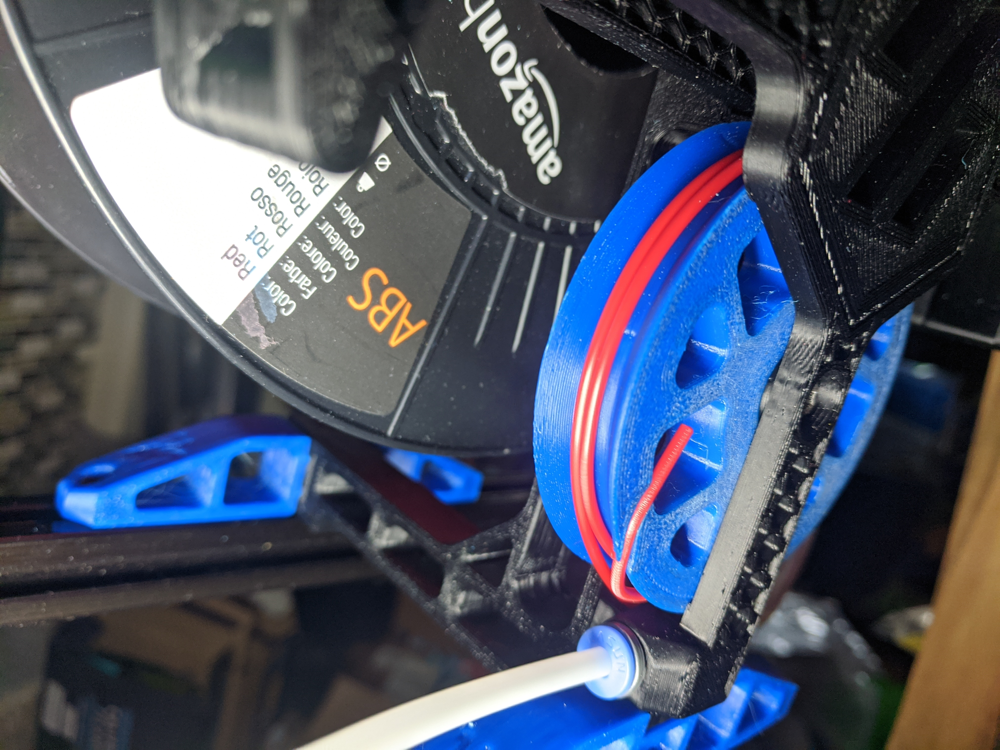
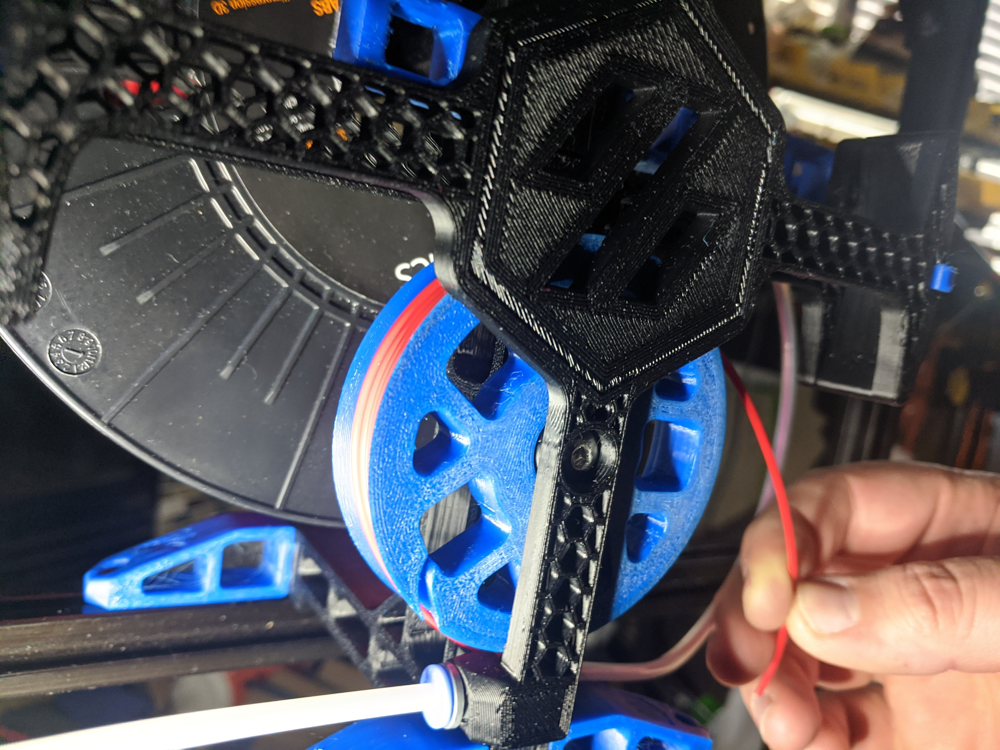

# ERCP Easy Load Buffer Wheel

This buffer wheel replaces the existing buffer wheel.

## To Load:
1) Feed the filament through the load tube.
2) Push the filament end into the slot on the side of the wheel, the curved profile should keep your filament secure.
3) Turn the wheel to load the buffer your required amount.
4) Position the wheel near the buffer exit fitting.
5) Unclip the end of the filament from the wheel and push it into the ERCF feed tube.

[Download STL](./STL/[a]_Buffer_Wheel_EZ_Loader.stl)

## Images

