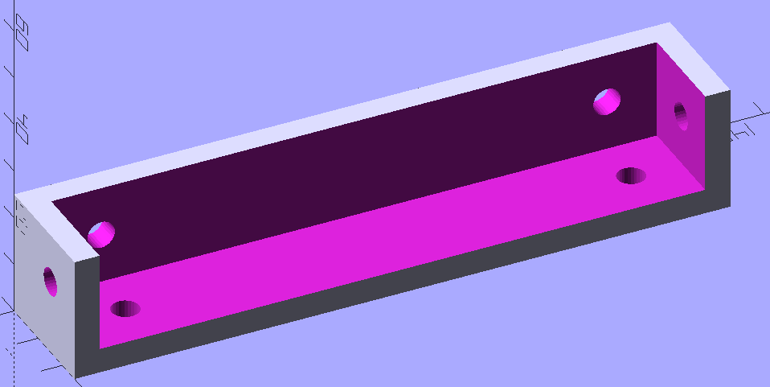
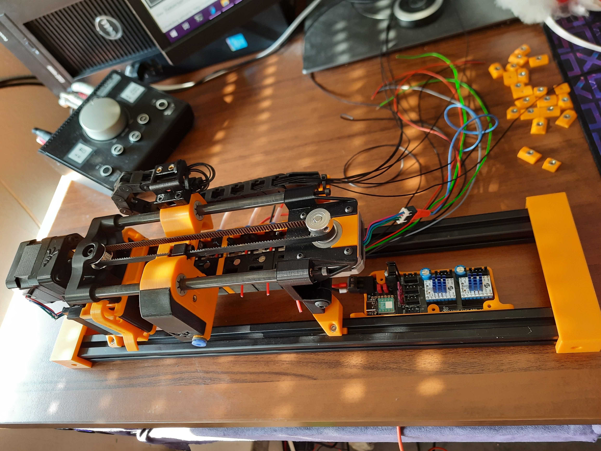
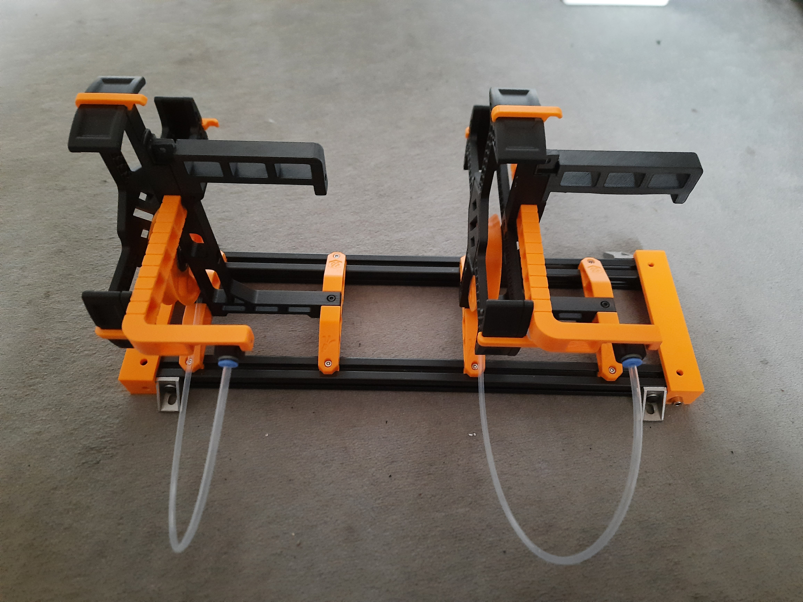

# ERCF and ERCP extrusion mounting brackets

These are simple extrusion mounting brackets with the (hopefully) correct
distances for the ERCF and ERCP. These allow you to pre-assemble an ERCF or
many ERCPs prior to mounting them on a frame or table. It's also useful to
prepare the wiring in conjunction with an ERCF Easy board.

The extrusion can be tapped, or you can use T-Nuts for mounting. Screw length
should be 10mm, but you can change the border for the bracket in the OpenSCAD
file and render a new variant.

