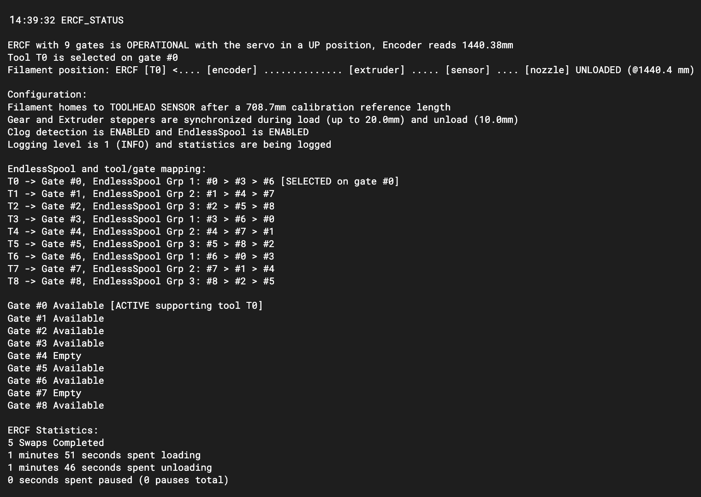
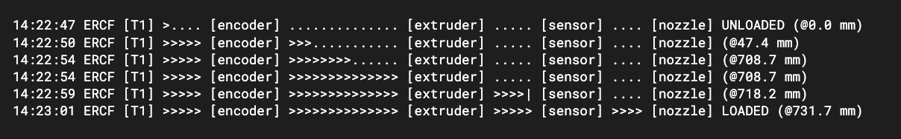
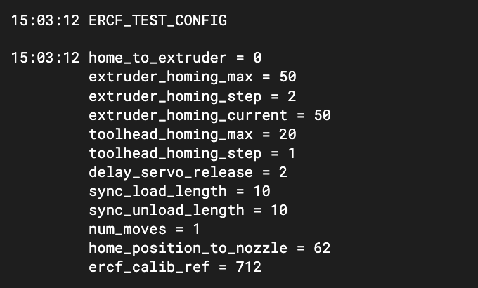

# ERCF-Software-V3 "Happy Hare"
I love my ERCF and building it was the most fun I've had in many years of the 3D-printing hobby. Whilst the design is brilliant I found a few problems with the software and wanted to add some features and improve user friendliness.  This became especially true after the separation of functionality with the introduction of the "sensorless" branch. I liked the new python implementation as a Klipper plug-in but wanted to leverage my (very reliable) toolhead sensor.  So I rewrote the software behind ERCF - it still has the structure and much of the code of the original but, more significantly, it has many new features, integrates the toolhead sensor and sensorless options.  I'm calling it the **"Happy Hare"** release or v3.

## Major new features:
<ul>
<li>Support all options for both toolhead sensor based loading/unloading and the newer sensorless filament homing (no toolhead sensor)
<li>Supports sync load and unloading steps moving the extruder and gear motor together, including a config with toolhead sensor that can work with FLEX materials!
  <li>Fully implements “EndlessSpool” with new concept of Tool --> Gate mapping.  This allows empty gates to be identified and tool changes subsequent to runout to use the correct filament spool.  It has the added advantage for being able to map gates to tools in case of slicing to spool loading mismatch.
<li>Measures “spring” in filament after extruder homing for more accurate calibration reference
<li>Adds servo_up delay making the gear to extruder transition of filament more reliable (maintains pressure)
<li>Ability to specify empty or disabled tools (gates).
<li>Formal support for the filament bypass block with associated new commands and state if using it.
<li>Ability to reduce gear current (currently TMC2209 only) during “collision” homing procedure to prevent grinding, etc.
<li>Convenience filament preload function and check gate feature to ensure filaments are all ready before print
</ul>

## Other features:
<ul>
<li>Optional fun visual representation of loading and unloading sequence
<li>Reworks calibration routine to average measurements, add compensation based on spring in filament (related to ID and length of bowden), and considers configuration options.
<li>Runtime configuration via new command (ERCF_TEST_CONFIG) for most options which avoids constantly restarting klipper or recalibrating during setup
<li>Workarond to some of the ways to provoke Klipper “Timer too close” errors (although there are definitely bugs in the Klipper firmware)
<li>More reliable “in-print” detection so tool change command “Tx” g-code can be used anytime and the user does not need to resort to “ERCF_CHANGE_TOOL_STANDALONE”
<li>New LOG_LEVEL=4 for developer use.  BTW This is useful in seeing the exact stepper movements
<li>New "TEST" commands to help diagnose issues with encoder
<li>Experimental logic to use stallguard filament homing (Caveat: not easy to setup using EASY-BRD and not compatible with sensorless selector homing option)
</ul>
  
## Other benefits of the code cleanup / rewrite:
<ul>
<li>Vastly increased error detection/checking.
<l1>Consistent handling of errors. E.g. use exceptions to avoid multiple calls to _pause()
<li>Wrapping of all stepper movements to facilitate “DEVELOPER” logging level and easier debugging
<li>Renewed load and unload sequences (to support all build configurations) and effectively combine the sensor and sensorless logic
</ul>
 
 
  
## Installation
The module can be installed into a existing Klipper installation with the install script. Once installed it will be added to Moonraker update-manager to easy updates like other Klipper plugins:

    cd ~
    git clone https://github.com/moggieuk/ERCF-Software-V3.git
    cd ERCF-Software-V3

    ./install.sh -i

The `-i` option will bring up some interactive prompts to aid setting some confusing parameters on EASY-BRD (like sensorless selector homing setup). If not run with the `-i` flag the new template .cfg files will not be installed.  Note that if existing ercf*.cfg files are found the old versions will be moved to <file>.00 extension instead so as not to overwrite an existing configuration.  If you still choose not to install the new ercf*.cfg files automatically be sure to examine them closely and compare to the supplied templates - some options have changed!
 

Be sure to read my [notes on Encoder problems](doc/ENCODER.md) - the better the encoder the better this software will work.

 
  
## Revision History
<ul>
<li> v1.0.0 - Initial Beta Release
<li> v1.0.3 - Bug fixes from community: Better logging on toolchange (for manual recovery); Advanced config parameters for adjust tolerance used in 'apply_bowden_correction' move; Fixed a couple of silly (non serious) bugs
<li> v1.1.0 - New commands: ERCF_PRELOAD & ERCF_CHECK_GATES ; Automatic setting of clog detection distance in calibration routine ; Eliminated DETAIL flags for status reporting (detail always present); New interactive install script to help EASY-BRD setup; Bug fixes
<li> v1.1.1 - Fixes for over zealous tolerance checks on bowen loading; Fix for unloading to far if apply_bowden_correction is active; new test command: ERCF_TEST_TRACKING; Fixed slicer based tool load issue; Improved install.sh -i to include servo and calib bowden length
<li> v1.1.2 - Fixes for over zealous tolerance checks on bowen loading; Fix for unloading to far if apply_bowden_correction is active; new test command: ERCF_TEST_TRACKING; Fixed slicer based tool load issue; Improved install.sh -i to include servo and calib bowden length; Better detection of malfunctioning toolhead sensor
<li> v1.1.3 - Added ERCF_RECOVER command to re-establish filament position after manual intervention and filament movement. Not necessary if you use ERCF commands to correct problem but useful to call prior to RESUME; Much improved install.sh to cover toolhead sensor and auto restart moonraker on first time install
<li> v1.1.4 - Change to automatic clog detection length based on community feedback
<li> v1.1.5 - Further install.sh improvements - no longer need filament_sensor defined or duplicate pin override if not using clog detection; Cleaned up documentation in template config file; Stallguard filament homing should now be possible (have to configure by hand); Additional configuration checks on startup; minor useabilty improvements based on community feedback
</ul>

 

## Summary of new commands:
  | Commmand | Description | Parameters |
  | -------- | ----------- | ---------- |
  | ERCF_STATUS | Report on ERCF state, cababilities and Tool-to-Gate map | SHOWCONFIG=\[0\|1\] Whether or not to describe the machine configuration in status message |
  | ERCF_TEST_CONFIG | Dump / Change essential load/unload config options at runtime | Many. Best to run ERCF_TEST_CONFIG without options to report all parameters that can be specified |
  | ERCF_DISPLAY_TTG_MAP | Displays the current Tool - to - Gate mapping (can be used all the time but generally designed for EndlessSpool  | None |
  | ERCF_REMAP_TTG | Reconfiguration of the Tool - to - Gate (TTG) map.  Can also set gates as empty! | TOOL=\[0..n\]  GATE=\[0..n\] Maps specified tool to this gate (multiple tools can point to same gate)  AVAILABLE=\[0\|1\]  Marks gate as available or empty |
  | ERCF_SELECT_BYPASS | Unload and select the bypass selector position if configured | None |
  | ERCF_LOAD_BYPASS | Does the extruder loading part of the load sequence - designed for bypass filament loading | None |
  | ERCF_TEST_HOME_TO_EXTRUDER | For calibrating extruder homing - TMC current setting, etc. | RETURN=\[0\|1\] Whether to return the filament to the approximate starting position after homing - good for repeated testing |
  | ERCF_TEST_TRACKING | Simple visual test to see how encoder tracks with gear motor | DIRECTION=\[-1\|1\] Direction to perform the test  STEP=\[0.5..20\] Size of individual steps Defaults to load direction and 1mm step size |
  | ERCF_PRELOAD | Preloads filament at the specified gate| GATE=\[0..n\] The specific gate to preload. If ommitted the currently selected gate can be loaded |
  | ERCF_CHECK_GATES | Inspect the gate(s) and mark availability | GATE=\[0..n\] The specific gate to check. If ommitted all gates will be checked (the default) |
  | ERCF_RECOVER | Recover filament position. Useful to call prior to RESUME if you intervene/manipulate filament by hand | None |
  
  Note that some existing commands have been enhanced a little.  See the [command reference](#ercf-command-reference) at the end of this page.
  
 

## New features in detail:
### Config Loading and Unload sequences explained
Note that if a toolhead sensor is configured it will become the default filament homing method and home to extruder an optional but unecessary step. Also note the home to extruder step will always be performed during calibration of tool 0 (to accurately set `ercf_calib_ref`) regardless of the `home_to_extruder` setting. For accurate homing and to avoid grinding, tune the gear stepper current reduction `extruder_homing_current` as a % of the default run current.

#### Possible loading options (ercf_parameters.cfg configuration) WITH toolhead sensor:

    Extruder homing config          Toolhead homing config     Notes
    ----------------------          ----------------------     -----
    
    1. home_to_extruder=0           toolhead_homing_max=20     This is probably the BEST option and can work with FLEX
                                    toolhead_homing_step=1     Filament. Filament loaded close to extruder gear, then is pulled
                                    sync_load_length=1         through to home on toolhead sensor by synchronized gear
                                                               and extruder motors
    
    2. home_to_extruder=0           toolhead_homing_max=20     Not recommended but can avoid problems with sync move.  The
                                    toolhead_homing_step=1     initial load to end of bowden must press the filament to
                                    sync_load_length=0         create spring so that extruder will pick up the filament
    
    3. home_to_extruder=1           toolhead_homing_max=20     Not recommended. The filament will be rammed against extruder
       extruder_homing_max=50       toolhead_homing_step=1     to home and then synchronously pulled through to home again on
       extruder_homing_step=2       sync_load_length=1         toolhead sensor (no more than 20mm away in this example)
       extruder_homing_current=50
    
    4. home_to_extruder=1           toolhead_homing_max=20     A bit redundant to home twice but allows for reliable filament
       extruder_homing_max=50       toolhead_homing_step=1     pickup by extruder, accurate toolhead homing and avoids 
       extruder_homing_step=2       sync_load_length=0         possible problems with sync move (like Timer too close)
       extruder_homing_current=50

#### Possible loading options WITHOUT toolhead sensor:
    5. home_to_extruder=1          sync_load_length=10         BEST option without a toolhead sensor.  Filament is homed to
       extruder_homing_max=50                                  extruder gear and then the initial move into the extruder is
       extruder_homing_step=2                                  synchronised for accurate pickup
       extruder_homing_current=50
  
    6. home_to_extruder=1          sync_load_length=0          Same as above but avoids the synchronous move.  Can be
       extruder_homing_max=50                                  reliable with accurate calibration reference length and
       extruder_homing_step=2                                  accurate encoder. Use of 'delay_servo_release' recommended
       extruder_homing_current=50.                             to keep pressure on the extruder gears for initial load

*Obviously the actual distances shown above may be customized*
  
  **Advanced options**
When not using synchronous load move the spring tension in the filament held by servo will be leverage to help feed the filament into the extruder. This is controlled with the `delay_servo_release` setting. It defaults to 2mm and is unlikely that it will need to be altered.
 An option to home to the extruder using stallguard `homing_method=1` is avaiable but not recommended: (i) it is not necessary with current reduction, (ii) it is not readily compatible with EASY-BRD and (iii) is currently incompatible with sensorless selector homing which hijacks the gear endstop configuration.
 The 'apply_bowden_correction' setting, if enabled, will make the driver "believe" the encoder reading and make correction moves to bring the filament to the desired end of bowden position. This is useful is you suspect slippage on high speed loading (requires accurate encoder). If disabled, the gear stepper will be solely responsible for filament positioning in bowden (requires minimal friction in feeder tubes). The associated (advanced) 'load_bowden_tolerance' defines the point at which to apply to correction moves. See 'ercf_parameters.cfg' for more details.
  
  **Note about post homing distance**
Regardless of loading settings above it is important to accurately set `home_to_nozzle` distance.  If you are not homing to the toolhead sensor this will be from the extruder entrance to nozzle.  If you are homing to toolhead sensor, this will be the (smaller) distance from sensor to nozzle.  For example in my setup of Revo & Clockwork 2, the distance is 72mm or 62mm respectively.
  
#### Possible unloading options:
This is much simplier than loading. The toolhead sensor, if installed, will automatically be leveraged as a checkpoint when extracting from the extruder.
`sync_unload_length` controls the mm of synchronized movement at start of bowden unloading.  This can make unloading more reliable if the tip is caught in the gears and will act as what Ette refers to as a "hair pulling" step on unload.  This is an optional step, set to 0 to disable.
  
 

### Tool-to-Gate (TTG) mapping and EndlessSpool application
When changing a tool with the `Tx` command the ERCF would by default select the filament at the gate (spool) of the same number.  The mapping built into this *Angry Hare* driver allows you to modify that.  There are 3 primarly use cases for this feature:
<ol>
  <li>You have loaded your filaments differently than you sliced gcode file... No problem, just issue the appropriate remapping commands prior to printing
  <li>Some of "tools" don't have filament and you want to mark them as empty to avoid selection.
  <li>Most importantly, for EndlessSpool - when a filament runs out on one gate (spool) then next in the sequence is automatically mapped to the original tool.  It will therefore continue to print on subsequent tool changes.  You can also replace the spool and update the map to indicate avaiablity mid print
</ol>

*Note that the initial availability of filament at each gate can also be specfied in the `ercf_parameters.cfg` file by updating the `gate_status` list. E.g.
>gate_status = 1, 1, 0, 0, 1, 0, 0, 0, 1

  on a 9-gate ERCF would mark gates 2, 3, 5, 6 & 7 as empty
 
To view the current mapping you can use either `ERCF_STATUS` or `ERCF_DISPLAY_TTG_MAP`
  

 
  
### Visualization of filament position
  The `log_visual` setting turns on an off the addition of a filament tracking visualization. Can be nice with log_level of 0 or 1 on a tuned and functioning setup.
  

  
 

### Filament bypass
If you have installed the optional filament bypass block your can configure its selector position by setting `bypass_selector` in `ercf_parameters.cfg`. Once this is done you can use the following command to unload any ERCF controlled filament and select the bypass:
  > ERCF_SELECT_BYPASS
  
  Once you have filament loaded upto the extruder you can load the filament to nozzle with
  > ERCF_LOAD_BYPASS

### Adjusting configuration at runtime
  All the essential configuration and tuning parameters can be modified at runtime without restarting Klipper. Use the `ERCF_TEST_CONFIG` command to do this:
  
  
  
  Any of the displayed config settings can be modifed.  E.g.
  > ERCF_TEST_CONFIG home_position_to_nozzle=45
  
  Will update the distance from homing postion to nozzle.  The change is designed for testing was will not be persistent.  Once you find your tuned settings be sure to update `ercf_parameters.cfg`
  
### Updated Calibration Ref
  Setting the `ercf_calib_ref` is slightly different in that it will, by default, average 3 runs and compsensate for spring tension in filament held by servo. It might be worth limiting to a single pass until you have tuned the gear motor current. Here is an example:
  
  
  
 

## My Testing:
  This software is largely rewritten as well as being extended and so, despite best efforts, has probably introducted some bugs that may not exist in the official driver.  It also lacks extensive testing on different configurations that will stress the corner cases.  I have been using successfully on Voron 2.4 / ERCF with EASY-BRD.  I use a self-modified CW2 extruder with foolproof microswitch toolhead sensor. My day-to-day configuration is to load the filament to the extruder in a single movement (num_moves=1), then home to toolhead sensor with synchronous gear/extruder movement (option #1 explained above).  I use the sensorless selector and have runout and EndlessSpool enabled.
  
> Klipper Host Version: v0.10.0-594
>  Primary MCU Klipper version: v0.10.0-594
>  EASY-BRD firmware version: v0.10.0-220

 

### My Setup:

### Some setup notes based on my learnings:
Firstly the importance of a reliable and fairly accurate encoder should not be under estimated. If you cannot get very reliable results from `ERCF_CALIBRATE_ENCODER` then don't proceed with setup - address the encoder problem first. Because the encoder is the HEART of ERCF I [created a how-to](doc/ENCODER.md) on fixing many possible problems with encoder.
<ul>
  <li>If using a toolhead sensor, that must be reliable too.  The hall effect based switch is very awkward to get right because of so many variables: strength of magnet, amount of iron in washer, even temperature, therefore I strongly recommend a simple microswitch based detection.  They work first time, every time.
  <li>The longer the bowden length the more important it is to calibrate correctly (do a couple of times to check for consistency).  Small errors multiply with longer moves!
  <li>Eliminate all points of friction in the filament path.  There is lots written about this already but I found some unusual places where filament was rubbing on plastic and drilling out the path improved things a good deal.
  <li>This version of the driver software both, compensates for, and exploits the spring that is inherently built when homing to the extruder.  The `ERCF_CALIBRATE_SINGLE TOOL=0` (which calibrates the *ercf_calib_ref* length) averages the measurement of multiple passes, measures the spring rebound and considers the configuration options when recommending and setting the ercf_calib_ref length.  If you change basic configuration options it is advisable to rerun this calibration step again.
  <li>The dreaded "Timer too close" can occur but I believe I have worked around most of these cases.  The problem is not always an overloaded mcu as often cited -- there are a couple of bugs in Klipper that will delay messages between mcu and host and thus provoke this problem.  To minimize you hitting these, I recommend you use a step size of 8 for the gear motor. You don't need high fidelity and this greatly reduces the chance of this error. Also, increasing 'num_moves' also is a workaround.  I'm not experiencing this and have a high speed (200 mm/s) single move load with a step size of 8.
  <li>The servo problem where a servo with move to end position and then jump back can occur due to bug in Klipper just like the original software. The workaroud is increase the same servo "dwell" config options in small increments until the servo works reliably. Note that this driver will retry the initial servo down movement if it detects slippage thus working around this issue to some extent.
  <li>I also added a 'apply_bowden_correction' config option that dictates whether the driver "believes" the encoder or not for long moves.  If enabled, the driver will make correction moves to get the encoder reading correct.  If disabled the gear stepper movement will be applied without slippage detection.  Details on when this is useful is documented in 'ercf_parameters'.  If enabled, the options 'load_bowden_tolerance' and 'unload_bowden_tolerance' will set the threshold at which correction is applied.
  <li>I highly recommend Ette's "sensorless selector" option -- it works well and provides for additional recovery abilities if filment gets stuck in encoder preventing selection of a different gate.
</ul>

Good luck and hopefully a little less *enraged* printing.  You can find me on discord as *moggieuk#6538*

  
  ---
  
# ERCF Command Reference
  
  *Note that some of these commands have been enhanced from the original*

  ## Logging and Stats
  | Commmand | Description | Parameters |
  | -------- | ----------- | ---------- |
  | ERCF_RESET_STATS | Reset the ERCF statistics | None |
  | ERCF_DUMP_STATS | Dump the ERCF statistics | None |
  | ERCF_SET_LOG_LEVEL | Sets the logging level and turning on/off of visual loading/unloading sequence | LEVEL=\[1..4\]  VISUAL=\[0\|1\] Whether to also show visual representation |
  | ERCF_STATUS | Report on ERCF state, cababilities and Tool-to-Gate map | SHOWCONFIG=\[0|1\] Whether or not to show the machine configuration in status message |
  | ERCF_DISPLAY_ENCODER_POS | Displays the current value of the ERCF encoder | None |
   

  ## Calibration
  | Commmand | Description | Parameters |
  | -------- | ----------- | ---------- |
  | ERCF_CALIBRATE | Complete calibration of all ERCF tools | None |
  | ERCF_CALIBRATE_SINGLE | Calibration of a single ERCF tool | TOOL=\[0..n\]  REPEATS=\[1..10\] How many times to repeat the calibration for reference tool T0 (ercf_calib_ref)  VALIDATE=\[0\|1\] If True then calibration of tool 0 will simply verify the ratio i.e. another check of encoder accuracy (should result in a ratio of 1.0) |
  | ERCF_CALIB_SELECTOR | Calibration of the selector for the defined tool | TOOL=\[0..n\] |
  | ERCF_CALIBRATE_ENCODER | Calibration routine for ERCF encoder | DIST=.. Distance to measure over. Longer is better, defaults to calibration default length  RANGE=.. Number of times to average over  SPEED=.. Speed of gear motor move. Defaults to long move speed  ACCEL=.. Accel of gear motor move. Defaults to motor setting in ercf_hardware.cfg |
   

  ## Servo and motor control
  | Commmand | Description | Parameters |
  | -------- | ----------- | ---------- |
  | ERCF_SERVO_DOWN | Enguage the ERCF gear | None |
  | ERCF_SERVO_UP | Disengage the ERCF gear | None |
  | ERCF_MOTORS_OFF | Turn off both ERCF motors | None |
  | ERCF_BUZZ_GEAR_MOTOR | Buzz the ERCF gear motor and report on whether filament was detected | None |
   

  ## Core ERCF functionality
  | Commmand | Description | Parameters |
  | -------- | ----------- | ---------- |
  | ERCF_PRELOAD | Preloads filament at the specified gate| GATE=\[0..n\] The specific gate to preload. If ommitted the currently selected gate can be loaded |
  | ERCF_UNLOCK | Unlock ERCF operations | None |
  | ERCF_HOME | Home the ERCF selector and optionally selects gate associated with the specified tool | TOOL=\[0..n\] |
  | ERCF_SELECT_TOOL | Selects the gate associated with the specified tool | TOOL=\[0..n\] The tool to be selected (technically the gate associated with this tool will be selected) |
  | ERCF_SELECT_BYPASS | Unload and select the bypass selector position if configured | None |
  | ERCF_LOAD_BYPASS | Does the extruder loading part of the load sequence - designed for bypass filament loading | None |
  | ERCF_CHANGE_TOOL | Perform a tool swap (generally called from 'Tx' macros) | TOOL=\[0..n\]  STANDALONE=\[0\|1\] Optional to force standalone logic (tip forming) |
  | ERCF_CHANGE_TOOL_STANDALONE | Deprecated. Perform tool swap outside of a print. Use 'ERCF_TOOL_CHANGE STANDALONE=1' | TOOL=\[0..n\] |
  | ERCF_EJECT | Eject filament and park it in the ERCF | None |
  | ERCF_PAUSE | Pause the current print and lock the ERCF operations | None |
  | ERCF_RECOVER | Recover filament position (state). Useful to call prior to RESUME if you intervene/manipulate filament by hand | None |
   

  ## User Testing
  | Commmand | Description | Parameters |
  | -------- | ----------- | ---------- |
  | ERCF_TEST_GRIP | Test the ERCF grip of the currently selected tool | None |
  | ERCF_TEST_SERVO | Test the servo angle | VALUE=.. Angle value sent to servo |
  | ERCF_TEST_MOVE_GEAR | Move the ERCF gear | LENGTH=..\[200\] Length of gear move in mm  SPEED=..\[50\] Stepper move speed50  ACCEL=..\[200\] Gear stepper accel |
  | ERCF_TEST_LOAD_SEQUENCE | Soak testing of load sequence. Great for testing reliability and repeatability| LOOP=..\[10\] Number of times to loop while testing  RANDOM=\[0 \|1 \] Whether to randomize tool selection  FULL=\[0 \|1 \] Whether to perform full load to nozzle or short load just past encoder |
  | ERCF_TEST_LOAD | Test loading filament | LENGTH=..[100] Test load the specified length of filament into selected tool |
  | (ERCF_LOAD) | Identical to ERCF_TEST_LOAD | |
  | ERCF_TEST_UNLOAD | Move the ERCF gear | LENGTH=..[100] Lenght of filament to be unloaded  UNKNOWN=\[0\|1\] Whether the state of the extruder is known. Generally 0 for standalone use, 1 simulates call as if it was from slicer when tip has already been formed |
  | ERCF_TEST_HOME_TO_EXTRUDER | For calibrating extruder homing - TMC current setting, etc. | RETURN=\[0\|1\] Whether to return the filament to the approximate starting position after homing - good for repeated testing |
  | ERCF_TEST_TRACKING | Simple visual test to see how encoder tracks with gear motor | DIRECTION=\[-1\|1\] Direction to perform the test  STEP=\[0.5..20\] Size of individual steps Defaults to load direction and 1mm step size |
  | ERCF_TEST_CONFIG | Dump / Change essential load/unload config options at runtime | Many. Best to run ERCF_TEST_CONFIG without options to report all parameters than can be specified |
   

  ## Tool to Gate map and Endless spool
  | Commmand | Description | Parameters |
  | -------- | ----------- | ---------- |
  | ERCF_ENCODER_RUNOUT | Filament runout handler that will also implement EndlessSpool if enabled | None |
  | ERCF_DISPLAY_TTG_MAP | Displays the current Tool -> Gate mapping (can be used all the time but generally designed for EndlessSpool  | None |
  | ERCF_REMAP_TTG | Reconfiguration of the Tool - to - Gate (TTG) map.  Can also set gates as empty! | TOOL=\[0..n\]  GATE=\[0..n\] Maps specified tool to this gate (multiple tools can point to same gate)  AVAILABLE=\[0\|1\]  Marks gate as available or empty |
  | ERCF_RESET_TTG_MAP | Reset the Tool-to-Gate map back to default | None |
  | ERCF_CHECK_GATES | Inspect the gate(s) and mark availability | GATE=\[0..n\] The specific gate to check. If ommitted all gates will be checked (the default) |
  
