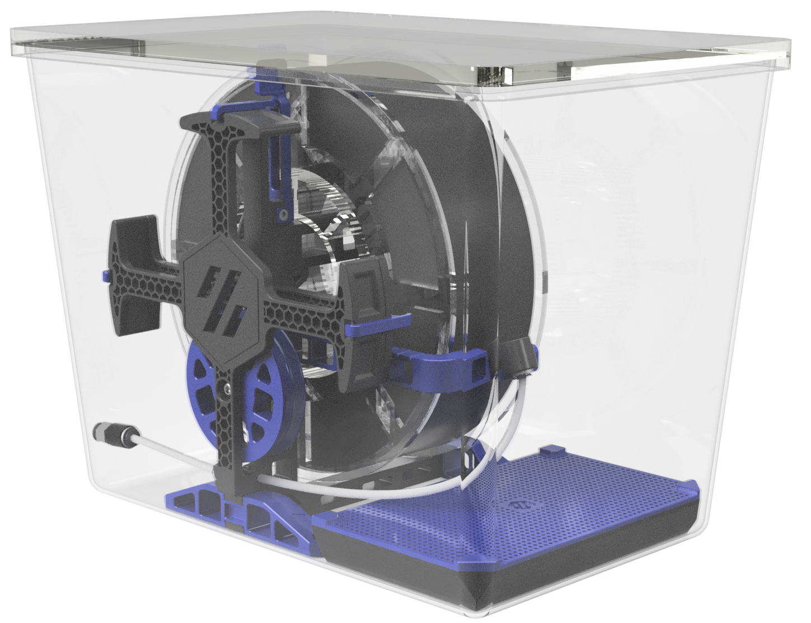
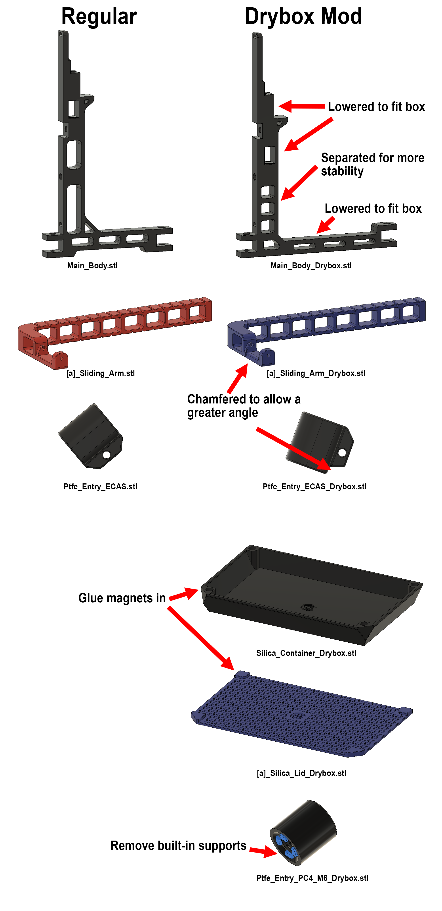

# Drybox Carrot Patch

## BOM
- [IKEA 365 +10.6l / 358 oz sealed food container](https://www.ikea.com/us/en/p/ikea-365-food-container-with-lid-rectangular-plastic-s79276760/) $9.99
- [PC4-M6 connector](https://de.aliexpress.com/item/32963618419.html) $0.37
- [Bowden Fitting](https://de.aliexpress.com/item/32934148155.html) $1.14
- [Bowden Clip](https://de.aliexpress.com/item/32892392365.html) $0.33
- [8pcs 6x3 rounded Neodym Magnets](https://de.aliexpress.com/item/1005001614008679.html) $2.51  50pcs
- [~150g Silica gel](https://de.aliexpress.com/item/4000144970813.html) $11 (locally waaaay cheaper)
- optional: [Humidity Meter](https://de.aliexpress.com/item/1005002050395803.html) $0.97
- optional: [40mm drill](https://de.aliexpress.com/item/4000866533733.html) $3.37

** optional: drill a hole in the front for a humidity meter

## Modified Parts
- [a]_Sliding_Arm.stl --> [a]_Sliding_Arm_Drybox.stl
- Main_Body.stl --> Main_Body_Drybox.stl
- Ptfe_Entry_ECAS.stl --> Ptfe_Entry_ECAS_Drybox.stl

** the original [a]_Handles are yet to be shortened in order to fit both the regular and drybox version

## New Parts
- [a]_Silica_Lid_Drybox.stl
- Silica_Container_Drybox.stl
- Ptfe_Entry_PC4_M6_Drybox.stl

## Pictures

## Comparison Original vs Drybox Version

