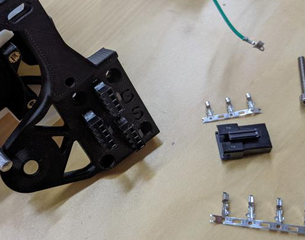
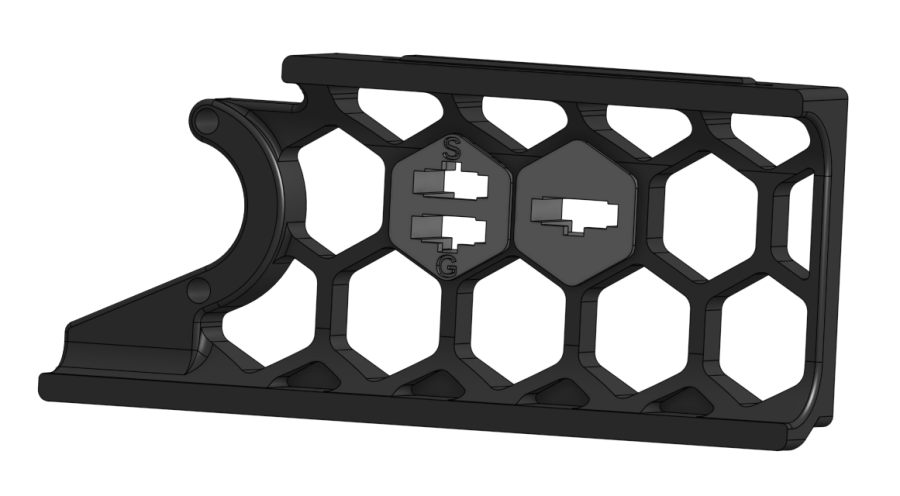
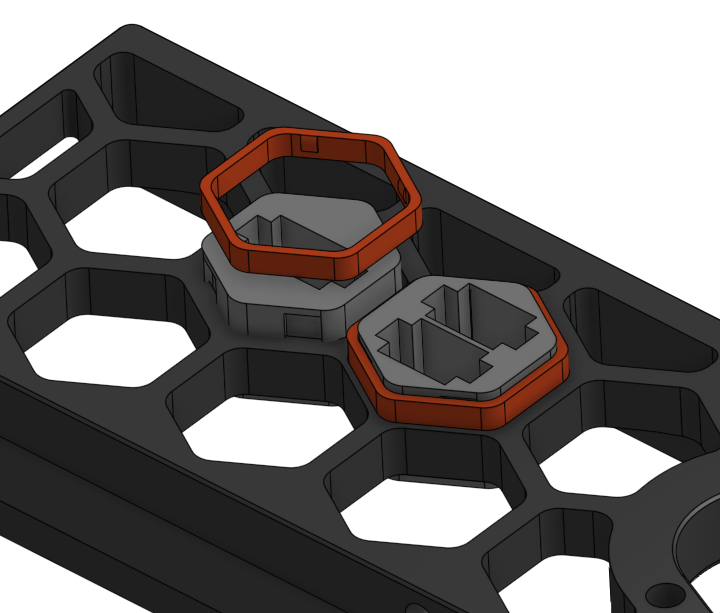

This Mod modifies the M4 Arm to use JST-SM instead of microfit connectors.

Furthermore for getting the cables through the Skirt into the Printer the Rabbit Holes allow for quick and easy connection through the Voron2.4 Skirts at any place you like.

