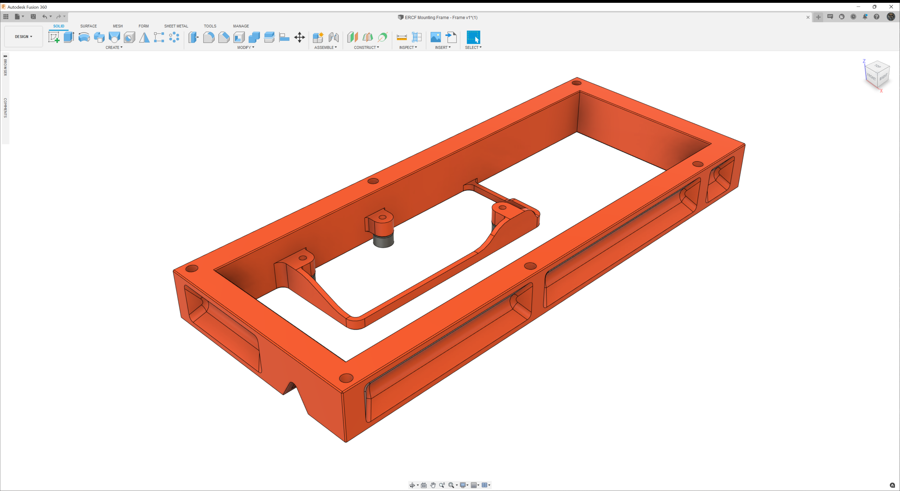

# Mounting Frame

Mounting frame for a 6x ERCF Setup - In case you do not have the otherwise necessary 2020 Extrusions at hand.

## Images

## Details

The intent for the Frame is to provide the necessary rgidity to the ERCF Assembly while tuning it off the 3D Printer. Does not come with the 3D printed hooks for attaching it to a Voron Frame.

The design assumes your ERCF being in spec with the distance between the two furthest apart lying mountinf holes along the length being 198mm in distance.
