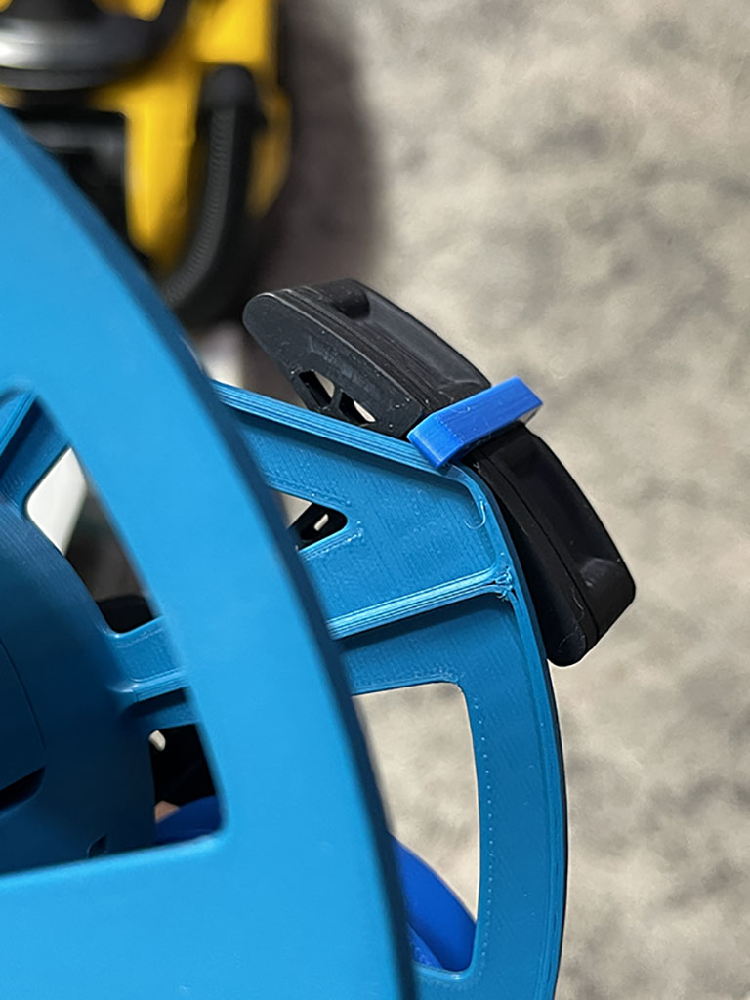
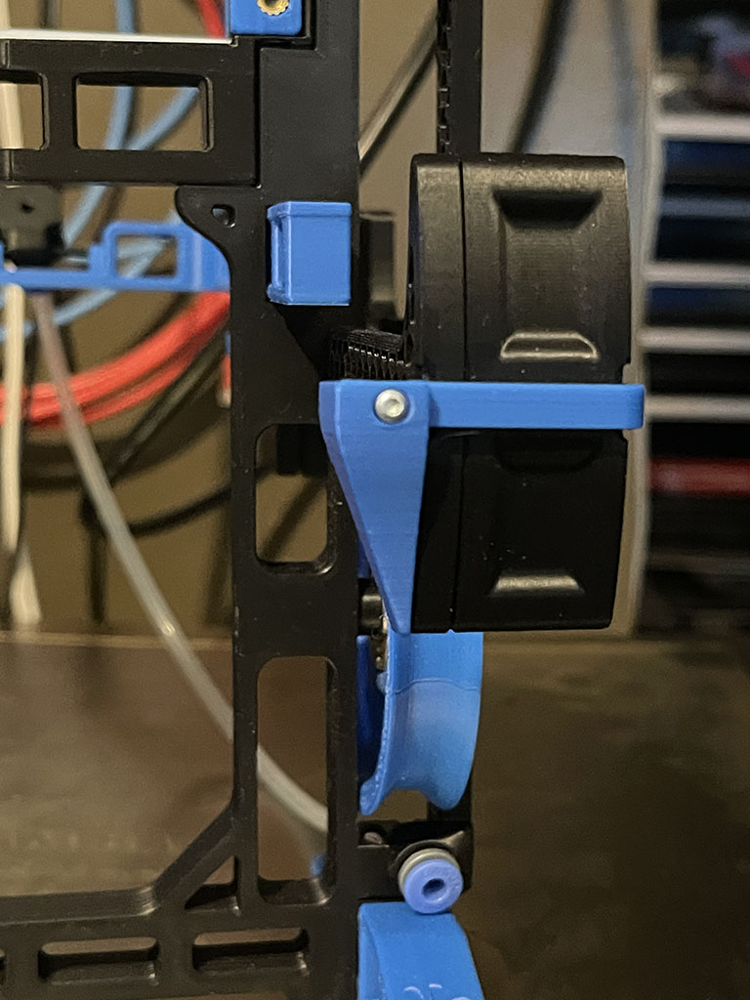

## Spool ramp for narrow slant spools

This is my attempt to fix an issue where my narrow slant spools would occassionally catch on the rear latch resulting in feed issues.

## Printing
Standard Voron print recommendations

## Parts needed
1 x M2x10 BCHS self tapping screw

1 x `Latch.stl` (for each carrot patch)

1 x `SpoolRamp.stl` (for each carrot patch)

## Assembly
Replace stock latch with modded latch.  The ramp is a loose fit onto the new latch, insert a M2x10 self tapping screw to secure. 

Stock carrot patch

with mod

