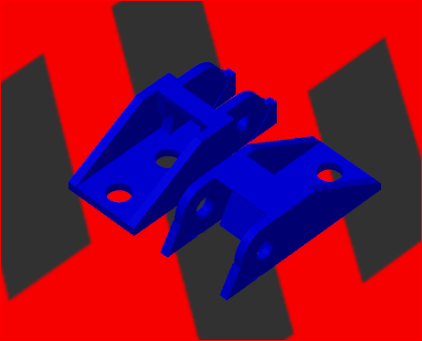
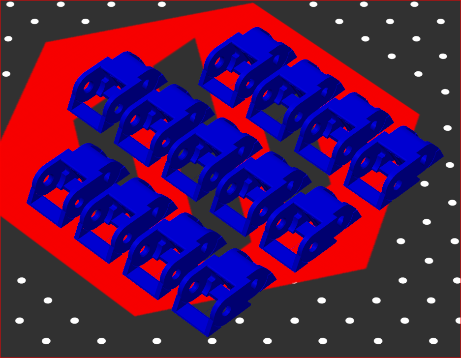

# ERCF Printable Drag Chain

A printable cable chain suitable for use with the [Enraged Rabbit Carrot Feeder][ercf], but the design is fully parametric so it can be resized to fit many applications.

The link design is taken from Thingiverse ["Yet Another Parametric Drag Chain"][thing] by **destroyer2012** and is licensed under Creative Commons CC-A (attribution required).

The two end links are original work, copyright © 2021 Timothy P. Long and licensed under the [Tigra MIT license][mit].

The Fusion 360 CAD model is included. The design is fully parametric so you can resize it how you like. The model is configured by default to be appropriate for use with ERCF (7x7mm internal size with mounting holes 10mm on centers).

## Printing Recommendations

Use your own discretion and experience, but as a staring point, we suggest:

- 0.4mm nozzle, 0.2mm layer height
- ABS or PETG. PLA _**not** recommended_ because it tends to creep over time and we have had a lot of problems with PLA cable chains falling apart after a few weeks.

For a 5-position ERCF, you need one of each end link and 13 mid links. We haven't measured other sizes.

Support material needed for printing is included in the model, there is no need to add any in the slicer. For this to work correctly, the correct orientation on the build plate must be used.

[thing]: https://www.thingiverse.com/thing:4598740 "Thingiverse thing:4598740"
[mit]: https://tigra.mit-license.org "Tigra MIT License"
[ercf]: https://github.com/EtteGit/EnragedRabbitProject "Enraged Rabbit Project"
