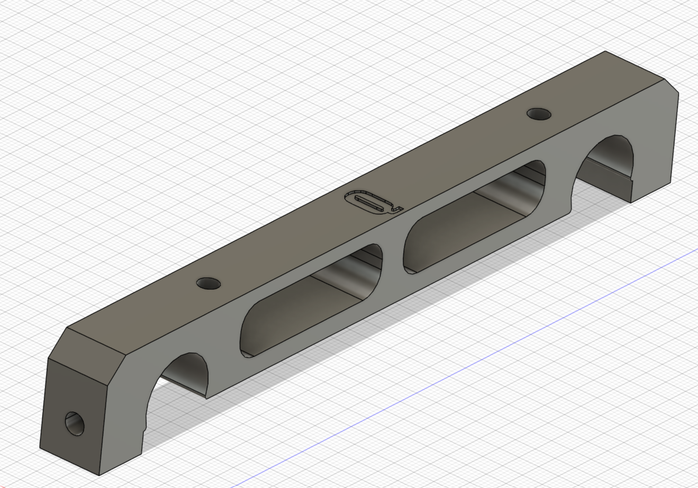
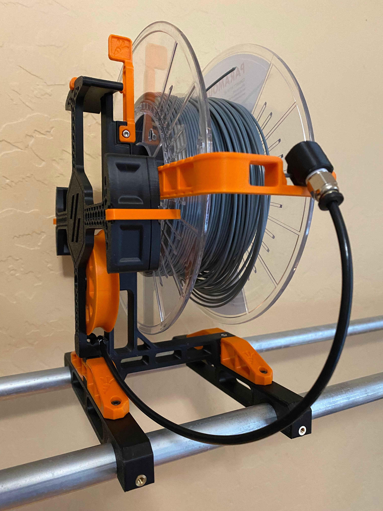

Carrot Patch spool mounting bracket for the [RepRack filament holder](https://www.prusaprinters.org/prints/129024-reprack-open-source-spool-holder-and-storage-syste). This is a cheap way to mount a bunch of filament to the wall above your printer.

# Assembly Instructions

1. Print as many mounts as you need
2. Install M3 heat inserts into the top two holes, and the side hole. Pro-tip: attach the heat insert using a short M3 bolt as a guide.
3. Attach the Carrot Patch spool with two M3x8 screws
4. Place the spool holder on the RepRack, optionally secure it with the front mount

# Version
* Version for non-covered tube: [Regular Version](RepRackErcfMount.stl)
* Version for Slip Rod Covered tube: [Slip Rod Compatible Version](RepRackErctMount_SlipRod.stl)

# Credit
* Regular Version: Designed in Fusion 360 by Danny Quist Discord: chamcham#6574
* [Slip Rod](https://www.printables.com/fr/model/135700-slip-rod-cover-for-reprack-and-repbox) compatible version: modified in ThinkerCAD by Flisher on Discord
