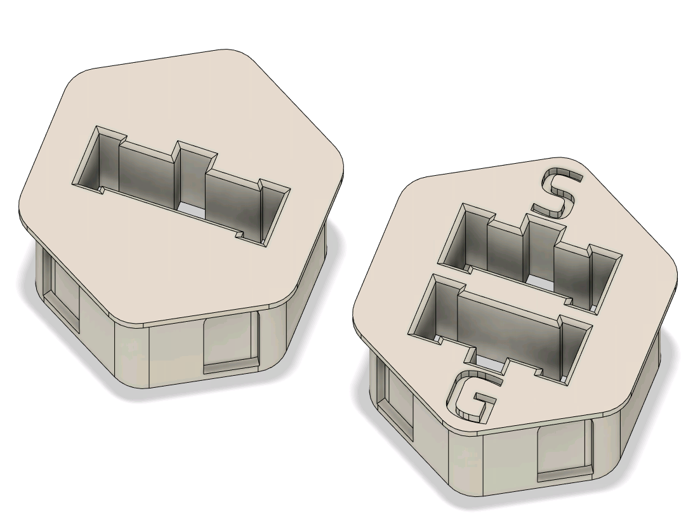

# Skirt inserts for Micro-Fit connectors

This is intended to be an alternative to the official part that adds the Micro-Fit connectors to the power outlet.  This mod consists of two insert that fit into a normal Voron V2 skirt.  The Micro-Fit connectors slide in from the back of the insert just like they do on the ERCF itself.  You'll want to print two of the lock rings and slide those over the inserts from the inside of the skirt.  The fit of the Micro-Fit connectors into the skirt inserts should be the roughly the same as it is on the ERCF itself, since the dimensions are based on that.

This mod is inspired by and heavily based on meteyou's [Gcode button mod](https://github.com/VoronDesign/VoronUsers/tree/master/legacy_printers/printer_mods/meteyou/gcode_buttons).

