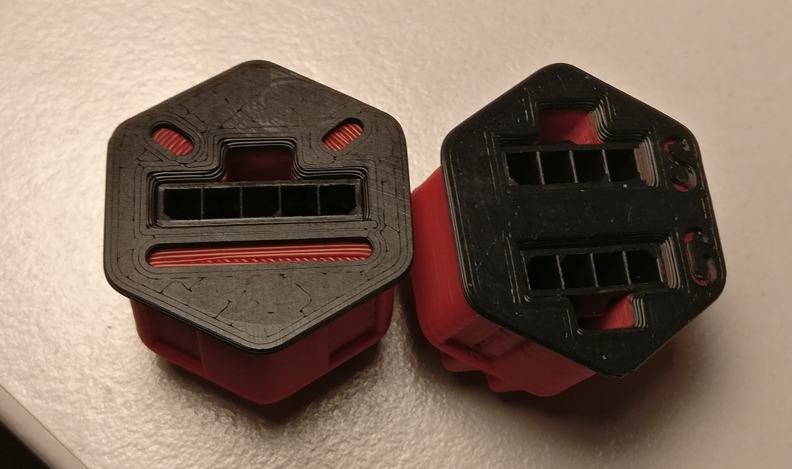
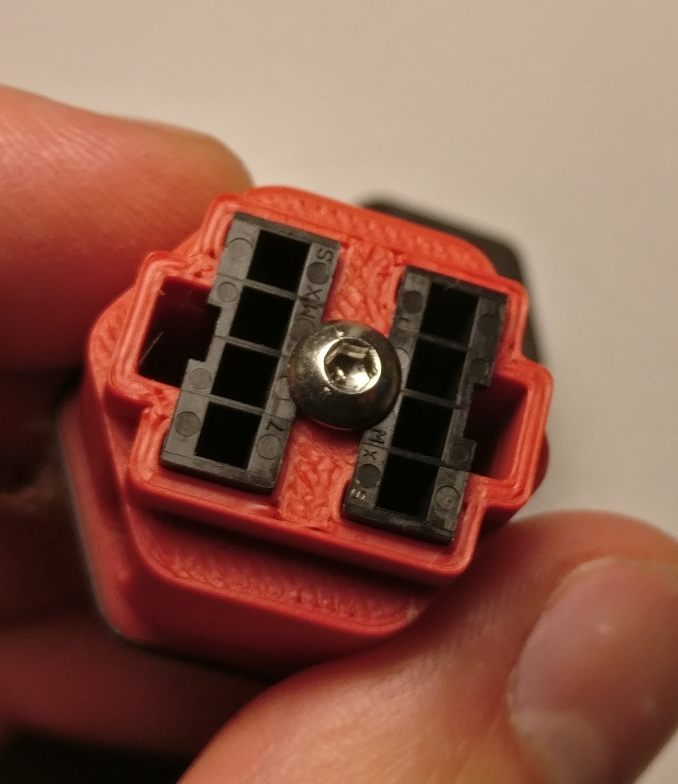

 An iteration on dvorak74's Micro-Fit inserts, based around meteyou's
 fantastic [G-code button mod](https://github.com/VoronDesign/VoronUsers/tree/master/legacy_printers/printer_mods/meteyou/gcode_buttons).Thanks to you both!

Tweaks from dvorak74's inserts:
-   Receptical housing sits deeper, does not protrude.
-   Securely retained by lip on the rear receptacle housing and an M3 bolt
-   Luchador flair

## Printing:
1x `5-pin_microfit_skirt_insert.stl` or `_luchador` version

1x `2x4-pin_microfit_skirt_insert.stl`

2x `lock_x2.stl`

Filament swap at 1mm height for contrast as images below.

## Assembly
1. Slot the insert in through the outside face of a skirt hexagon.
2. Secure the insert with a lock ring on the back face.
3. Slide Molex Micro-Fit 3.0 housing(s) through the back side of the inserts.
4. Secure with an M3 button head (ISO7380) screw (6-16 mm long) threaded into
    the plastic plastic.

